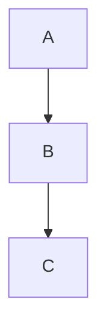

# AI x Physics 课程主页

这是一个基于 VitePress 构建的AI与物理学交叉课程的知识库网站。

## 🚀 快速开始

### 环境要求
- Node.js 20+
- Yarn (推荐) 或 npm

### 安装依赖
```bash
yarn install
```

### 开发模式
```bash
yarn docs:dev
```

访问 `http://localhost:5173` 查看网站。

### 构建生产版本
```bash
yarn docs:build
```

### 预览生产版本
```bash
yarn docs:preview
```

## 📁 项目结构

```
ai4s-blog/
├── docs/                    # 文档源文件
│   ├── .vitepress/         # VitePress 配置
│   │   ├── config.ts       # 主配置文件
│   │   ├── components/     # Vue 组件
│   │   │   ├── ScoreQuery.vue      # 成绩查询组件
│   │   │   └── CodeFileViewer.vue  # 代码文件查看器
│   │   ├── theme/          # 自定义主题
│   │   │   ├── index.ts    # 主题入口（组件注册）
│   │   │   └── custom.css  # 自定义样式
│   │   ├── cache/          # 构建缓存
│   │   └── dist/           # 构建输出
│   ├── course/             # 课程介绍
│   │   └── llm-agent/      # LLM Agent 技术文档
│   │       └── code-examples/  # 代码示例索引
│   ├── setup/              # 环境配置
│   ├── assignments/        # 作业指南
│   ├── resources/          # 学习资源
│   ├── public/             # 静态资源
│   │   ├── score/          # 成绩数据
│   │   │   ├── 58/         # 服务器 58 数据
│   │   │   ├── 132/        # 服务器 132 数据
│   │   │   └── 197/        # 服务器 197 数据
│   │   └── course/llm-agent/code-examples/  # 代码示例文件
│   ├── score-query.md      # 成绩查询页面
│   └── index.md           # 首页
├── deploy/                 # 部署配置
├── package.json
├── tsconfig.json
└── README.md
```

## 📝 内容编辑

### 添加新页面
1. 在相应目录下创建 `.md` 文件
2. 在 `docs/.vitepress/config.ts` 中更新侧边栏配置
3. 使用标准的 Markdown 语法编写内容

### Markdown 扩展
- 支持数学公式 (KaTeX)
- 支持代码高亮
- 支持自定义容器 (tip, warning, info)
- 支持 Mermaid 图表

### 示例语法
```markdown
::: tip 提示
这是一个提示框
:::

::: warning 注意
这是一个警告框
:::

::: info 信息
这是一个信息框
:::

# 数学公式
$$E = mc^2$$

# Mermaid 图表


## ✨ 其他功能

### 成绩查询系统
网站集成了学生成绩查询功能，学生可以通过学号查询自己的作业成绩信息。

**功能特点：**
- 🔍 通过学号快速查询成绩
- 📊 显示作业提交状态、收取时间、检查时间
- 📝 查看详细的作业评语和分数
- 🔄 支持多服务器数据源（58, 132, 197）
- 📱 响应式设计，支持移动端访问

**访问方式：**
- 在网站导航栏点击"成绩查询"
- 或直接访问 `/score-query` 页面

### 课程反馈问卷
网站集成了自动弹出的问卷调查功能，用于收集学生对课程的反馈意见。

**功能特点：**
- 📋 自动弹出问卷（页面加载 3 秒后）
- 💾 本地存储已填写状态，避免重复打扰
- 🔒 防误触设计，只能通过关闭按钮或"暂不填写"按钮关闭
- 📝 收集满意度、难度、有帮助的内容、建议等信息
- 💿 反馈数据本地保存，保护用户隐私

**数据保存位置：**
- 反馈数据保存在 `docs/public/feedback/` 目录
- 每份反馈独立保存为 JSON 文件（按时间戳命名）
- 同时追加到 `feedback-summary.jsonl` 汇总文件

**管理反馈：**
```bash
# 查看所有反馈文件
ls docs/public/feedback/

# 查看单个反馈
cat docs/public/feedback/feedback-2026-01-08T12-30-45-123Z.json

# 查看汇总文件（每行一条 JSON 记录）
cat docs/public/feedback/feedback-summary.jsonl
```

**重新启用问卷：**
如需让所有用户重新填写问卷，可以修改 `docs/.vitepress/components/FeedbackSurvey.vue` 中的 `SURVEY_VERSION` 常量：
```typescript
const SURVEY_VERSION = 'v2'  // 从 'v1' 改为 'v2'
```

## 🎨 主题定制

主题配置在 `docs/.vitepress/config.ts` 中，包括：
- 导航栏设置（包括成绩查询入口）
- 侧边栏配置
- 搜索功能
- 社交链接
- 页脚信息

## 🔧 技术栈

- **VitePress**: 静态站点生成器
- **TypeScript**: 类型安全的配置
- **Markdown**: 内容编写
- **Vue 3**: 组件开发 (如需要)

## 📚 文档规范

### 文件命名
- 使用小写字母和连字符
- 英文命名，便于 URL 生成
- 示例：`computer-basics.md`

### 内容结构
- 每个页面都应该有清晰的标题层级
- 使用适当的 Markdown 语法
- 添加必要的代码示例和图表

### 链接规范
- 内部链接使用相对路径
- 外部链接在新窗口打开
- 确保链接的有效性

### 代码示例管理
- Python 代码文件 (`.py`) 和依赖文件 (`.txt`) 存放在 `docs/public/` 目录下
- 在 Markdown 中使用绝对路径链接到这些文件：`/course/llm-agent/code-examples/filename.py`
- VitePress 配置中已设置忽略对代码文件的死链接检查
- 代码文件会作为静态资源直接提供下载

### 成绩数据管理
成绩数据存储在 `docs/public/score/` 目录下，按服务器分类管理。

**目录结构：**
```
docs/public/score/
├── 58/                              # 服务器 58
│   ├── assignment1_update_log.csv   # 作业1提交记录
│   └── stu{学号}/                   # 学生目录
│       ├── 1-score.txt              # 作业1分数
│       └── 1-feedback.txt           # 作业1评语
├── 132/                             # 服务器 132
└── 197/                             # 服务器 197
```

**CSV 文件格式：**
```csv
学号,姓名,作业状态,最后修改时间,更新状态,检查时间
2401110095,张三,已提交,2025-09-29 02:25:43,无变化,2025-10-04 01:06:17
2401110103,李四,未提交,,无作业,2025-10-04 01:06:17
```

**分数文件格式：**
- 文件名：`{作业编号}-score.txt`
- 内容：纯数字，如 `95` 或 `88.5`

**评语文件格式：**
- 文件名：`{作业编号}-feedback.txt`
- 内容：纯文本评语，支持多行

**数据更新流程：**
1. 更新 CSV 文件中的作业提交记录
2. 在对应学生目录下创建/更新分数和评语文件
3. 重新构建或部署网站以更新数据

**缓存处理：**
- 前端已实现缓存破坏机制，每次查询都会获取最新数据
- 建议在服务器端配置缓存策略（参考 `deploy/score-cache.conf`）
- 如果使用 CDN，需要在更新数据后手动刷新 CDN 缓存

## 🤝 贡献指南

### 提交规范
- 使用清晰的提交信息
- 每次提交专注于单一功能或修复
- 遵循 Conventional Commits 规范

### 代码审查
- 提交前检查拼写和语法
- 确保链接和代码示例正确
- 测试构建是否成功

## 🔧 故障排除

### 常见问题

#### 构建失败：找不到模块 "vitepress"
```bash
# 重新安装依赖
rm -rf node_modules yarn.lock
yarn install
```

#### 代码文件链接显示 404 或编码错误
- 确保代码文件已放置在 `docs/public/` 目录下
- 检查 Markdown 中的链接路径是否正确（使用绝对路径）
- 验证 `config.ts` 中的 `ignoreDeadLinks` 配置

#### 构建时出现死链接警告
```typescript
// 在 docs/.vitepress/config.ts 中添加：
ignoreDeadLinks: [
  /\/.*\.(py|txt)$/,  // 忽略代码文件的死链接检查
],
```

#### 开发服务器启动失败
```bash
# 清理缓存并重启
rm -rf docs/.vitepress/cache
yarn docs:dev
```

#### 数学公式不显示
确保在 `config.ts` 中启用了数学支持：
```typescript
markdown: {
  math: true
}
```

### 调试技巧
- 使用 `yarn docs:build` 检查构建错误
- 查看浏览器控制台的错误信息
- 检查文件路径和大小写是否正确

## 📄 许可证

MIT License - 详见 [LICENSE](LICENSE) 文件。

## 🆘 获取帮助

如果遇到问题：
1. 查看 [VitePress 官方文档](https://vitepress.dev/)
2. 查看上方的故障排除部分
3. 在项目 Issues 中搜索相关问题
4. 联系课程技术支持

---

*这个项目旨在为 AI x Physics 课程提供一个现代化、易于维护的文档平台。*
