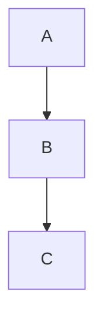

# AI x Physics 课程主页

这是一个基于 VitePress 构建的AI与物理学交叉课程的知识库网站。

## 🚀 快速开始

### 环境要求
- Node.js 20+
- Yarn (推荐) 或 npm

### 安装依赖
```bash
yarn install
```

### 开发模式
```bash
yarn docs:dev
```

访问 `http://localhost:5173` 查看网站。

### 构建生产版本
```bash
yarn docs:build
```

### 预览生产版本
```bash
yarn docs:preview
```

## 📁 项目结构

```
ai4s-blog/
├── docs/                    # 文档源文件
│   ├── .vitepress/         # VitePress 配置
│   │   ├── config.ts       # 主配置文件
│   │   ├── cache/          # 构建缓存
│   │   ├── dist/           # 构建输出
│   │   └── theme/          # 自定义主题
│   ├── course/             # 课程介绍
│   │   └── llm-agent/      # LLM Agent 技术文档
│   │       └── code-examples/  # 代码示例索引
│   ├── setup/              # 环境配置
│   ├── assignments/        # 作业指南
│   ├── resources/          # 学习资源
│   ├── public/             # 静态资源
│   │   └── course/llm-agent/code-examples/  # 代码示例文件
│   └── index.md           # 首页
├── deploy/                 # 部署配置
├── package.json
├── tsconfig.json
└── README.md
```

## 📝 内容编辑

### 添加新页面
1. 在相应目录下创建 `.md` 文件
2. 在 `docs/.vitepress/config.ts` 中更新侧边栏配置
3. 使用标准的 Markdown 语法编写内容

### Markdown 扩展
- 支持数学公式 (KaTeX)
- 支持代码高亮
- 支持自定义容器 (tip, warning, info)
- 支持 Mermaid 图表

### 示例语法
```markdown
::: tip 提示
这是一个提示框
:::

::: warning 注意
这是一个警告框
:::

::: info 信息
这是一个信息框
:::

# 数学公式
$$E = mc^2$$

# Mermaid 图表


## 🎨 主题定制

主题配置在 `docs/.vitepress/config.ts` 中，包括：
- 导航栏设置
- 侧边栏配置
- 搜索功能
- 社交链接
- 页脚信息

## 🔧 技术栈

- **VitePress**: 静态站点生成器
- **TypeScript**: 类型安全的配置
- **Markdown**: 内容编写
- **Vue 3**: 组件开发 (如需要)

## 📚 文档规范

### 文件命名
- 使用小写字母和连字符
- 英文命名，便于 URL 生成
- 示例：`computer-basics.md`

### 内容结构
- 每个页面都应该有清晰的标题层级
- 使用适当的 Markdown 语法
- 添加必要的代码示例和图表

### 链接规范
- 内部链接使用相对路径
- 外部链接在新窗口打开
- 确保链接的有效性

### 代码示例管理
- Python 代码文件 (`.py`) 和依赖文件 (`.txt`) 存放在 `docs/public/` 目录下
- 在 Markdown 中使用绝对路径链接到这些文件：`/course/llm-agent/code-examples/filename.py`
- VitePress 配置中已设置忽略对代码文件的死链接检查
- 代码文件会作为静态资源直接提供下载

## 🤝 贡献指南

### 提交规范
- 使用清晰的提交信息
- 每次提交专注于单一功能或修复
- 遵循 Conventional Commits 规范

### 代码审查
- 提交前检查拼写和语法
- 确保链接和代码示例正确
- 测试构建是否成功

## 🔧 故障排除

### 常见问题

#### 构建失败：找不到模块 "vitepress"
```bash
# 重新安装依赖
rm -rf node_modules yarn.lock
yarn install
```

#### 代码文件链接显示 404 或编码错误
- 确保代码文件已放置在 `docs/public/` 目录下
- 检查 Markdown 中的链接路径是否正确（使用绝对路径）
- 验证 `config.ts` 中的 `ignoreDeadLinks` 配置

#### 构建时出现死链接警告
```typescript
// 在 docs/.vitepress/config.ts 中添加：
ignoreDeadLinks: [
  /\/.*\.(py|txt)$/,  // 忽略代码文件的死链接检查
],
```

#### 开发服务器启动失败
```bash
# 清理缓存并重启
rm -rf docs/.vitepress/cache
yarn docs:dev
```

#### 数学公式不显示
确保在 `config.ts` 中启用了数学支持：
```typescript
markdown: {
  math: true
}
```

### 调试技巧
- 使用 `yarn docs:build` 检查构建错误
- 查看浏览器控制台的错误信息
- 检查文件路径和大小写是否正确

## 📄 许可证

MIT License - 详见 [LICENSE](LICENSE) 文件。

## 🆘 获取帮助

如果遇到问题：
1. 查看 [VitePress 官方文档](https://vitepress.dev/)
2. 查看上方的故障排除部分
3. 在项目 Issues 中搜索相关问题
4. 联系课程技术支持

---

*这个项目旨在为 AI x Physics 课程提供一个现代化、易于维护的文档平台。*
