# 作业3：物理信息神经网络求解泊松方程 - 参考题解

**作者**: 夏省玘

**代码与报告**: <a href="/assignment3_report.zip" download="assignment3_report.zip">assignment3_report.zip</a>

## 问题描述

[本作业](https://aiphy.pku.edu.cn/assignments/assignment-3)要求使用物理信息神经网络（PINN）求解如下三维空间中的泊松方程：

$$
\nabla^2\phi=-\rho(x,y,z)
$$

其中$\rho(x,y,z)=100xyz^2$，边界条件为 $\phi=0$ 。

求解该问题需要以下步骤：

1. **搭建**一个神经网络模型，模型输入一个三维矢量表示场点$(x,y,z)$，输出一个标量表示该点电势$\phi$。
2. **构造**一个合适的损失函数，反映一个模型对物理规律的偏差。这里由两条物理规律，分别是泊松方程和边界条件，我们需要在损失函数中同时反映两条规律。
3. **生成**训练集和测试集。
4. **训练**神经网络模型，**保存**训练曲线和模型参数。
5. **可视化**模型，也就是可视化求解得到的势能函数。我们不需要额外测试测试边界条件和PDE残差，因为它已经记录在了训练曲线中。

然而，仅靠这些步骤不足以获得一个问题的较优解，因为存在以下问题：

- 所用神经**网络结构**是否合理，能够产生足够复杂的行为拟合所求势函数，而且能够收敛？
- 损失函数如何**平衡**两条物理规律的权重？
- 如何取训练集和测试集的**大小和采样**，才能够让模型表现足够良好？
- 边界条件和PDE残差不是衡量势函数是否准确的**金标准**，与理论解的平方误差才是。因此，只有实现了理论解，才能回答上面三个问题。

为此，我们还需要测试如下超参数：

- 全连接网络的层数$h$和每层的神经元个数$w$；
- 训练集每一轮在体内和边界的采样数量$N_p,N_b$；
- 损失函数中两条物理规律的权重比$\beta$；
- 估算理论解时所用的网格密度与截断项数。

**特别注意**：物理信息神经网络不允许使用理论解直接参与网络损失的计算。理论解唯一的用处在于验证超参数取值是否合理，从而我们可以使用同样的超参数求解不存在理论解的其它物理问题。

## 模型设计

本项目所用的**神经网络**为全连接层神经网络，使用tanh作为激活函数。

每一层隐藏层的宽度相等，均为$w$；隐藏层层数为$h$。

```
FC(3,W) --> Tanh() --> FC(W,W) --> Tanh() --> ... --> FC(W,1)
                       |<--------共H层隐藏层------->|
```

$h$与$w$的取值待定，一个较优的取值为$h=5,w=128$。

见`pinn_class.py`中的`PINN`类。

## 损失函数设计

**损失函数**如下定义：

$$
\mathcal{L}=\mathcal{L}_\mathrm{PDE}+\beta\cdot \mathcal{L}_\mathrm{boundary}
$$

其中

$$
\mathcal{L}_\mathrm{PDE}=\frac1{N_p}\sum_{i=1}^{N_p}(\nabla^2\phi(\vec{p}_i)+\rho(\vec{p}_i))
$$

$$
\mathcal{L}_\mathrm{boundary}=\frac1{N_b}\sum_{i=1}^{N_b}\phi(\vec{p}_i)
$$

$\beta$是边界损失和PDE损失的比值，在$10^{-3}\sim10^6$的广阔范围内取值都是合理的。一个较优的取值为$\beta=10^3$。（需要指出：该$\beta$定义与作业网站上的定义差一个倒数）

$N_p$为评估PDE损失所用采样点的个数，$N_b$为评估边界损失所用采样点的个数。我们在训练的时候，使用了$N_p=10000,N_b=6\times1000$。这样的取值大约占用一半的显存。

每epoch，从$(-1,1)^3$内的均匀分布，生成$N_p=10000$个随机坐标用以评估PDE损失；对于每个边界平面，从$(-1,1)^3$内的均匀分布，各生成$\frac16N_b=1000$个随机坐标，然后投影到边界平面上用以评估边界损失。

需要指出：在我们的代码中，每轮训练评估损失时都会重新采样所有数据点，以增强模型的泛化能力。同时，由于每轮训练都使用与之前不同的数据，因此不需要专门的测试集。

<!-- 另外：我们的随机数生成算法使用`torch.rand`函数，该函数使用专用算法在GPU上直接生成伪随机数，并且从随机数生成采样点的过程也完全张量化，这样可以最小化CPU-GPU通信，增大训练效率。

以下我将详细说明生成边界采样点的张量化算法：

1. 首先生成一个`(6000, 3)`形状的随机张量，相当于6000个坐标点；
2. 将该随机张量从`(0,1)`范围内缩放到`(-1,1)`范围内。
3. 将该张量直接乘以一个形状为`(6000, 3)`的`boundary_hollow_mat`张量，相当于另外6000个坐标。该张量在前2000个点处x为0，中间2000个点处y为0，后2000个点处z为0，其余位置均为1。它的作用相当于把所有的点投影到对应的坐标平面上，如前2000个点投影到了yOz平面上，后2000个点投影到了xOy平面上。
4. 将上述结果加上一个形状为`(6000, 3)`的`boundary_hollow_mat`张量。该张量在前1000个点处x为1，之后1000个点x为-1，其余位置为0；以此类推到y和z。它的作用相当于把坐标平面上的点移动到对应的求解区域的边界上。

这样的算法没有条件控制流语句，能够在显卡中高效并行计算。 -->

见`pinn_class.py`中的`Loss`类。该类同时用于生成训练集。

## 训练函数

训练流程如下：

1. 初始化Loss类（损失函数和训练集）、默认参数的Adam优化器、tensorboard训练曲线记录器、进度条。开始每一步训练。
2. `optimizer.zero_grad()`：优化器梯度归零；
3. `loss_func()`：生成PDE采样数据点和边界数据点，正向传播，得到势函数值，然后评估PDE损失与边界损失；
4. 记录当前的PDE损失和边界损失；
5. `loss = loss_pde + beta * loss_bc`：合成总损失；
6. 如果当前的总损失历史最小，那么保存模型；
7. `loss.backward()`：反向传播总损失，获得每个模型参数的梯度信息；
8. `optimizer.step()`：使用Adam优化器优化模型参数；
9. 更新进度条；
10. 进入下一步训练，直至训练结束。
11. 保存最终模型。

见`pinn_class.py`中的`train()`函数。

## 可视化方案

对于训练过程中的PDE损失和边界损失，我们直接使用tensorboard作为现成的可视化方案。运行`tensorboard --logdir ./results/log/`，将6006端口SSH转发到本地端口，然后使用浏览器访问对应的本地端口，即可看到损失曲线。

合适参数大小模型的训练曲线：


模型过小时，会发生欠拟合：
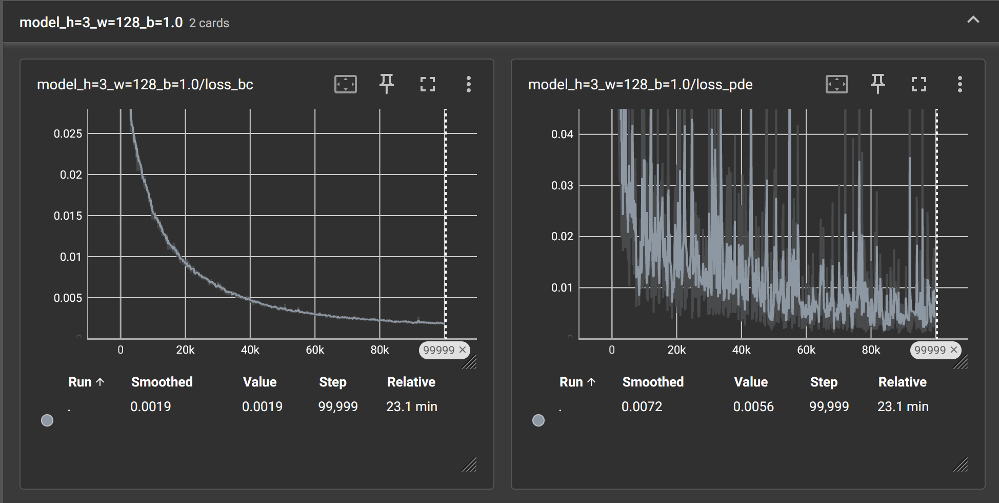

模型过大时，训练将不收敛：
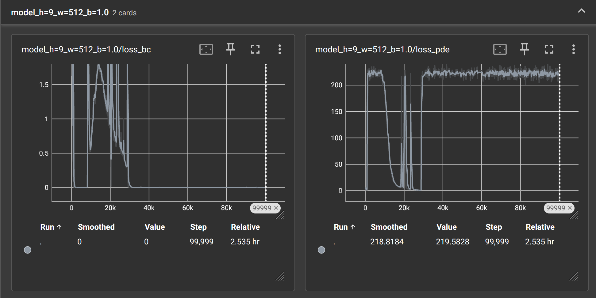

---

对于模型势函数的可视化，我们取“平行于xOz平面、y=-0.5,0.2,0.8”的截面，和“平行于xOy平面、z=-0.5,0.2,0.8”的截面，在二维平面上绘制函数在所选截面上的值，用颜色表示高度，用白色曲线标出等高线。

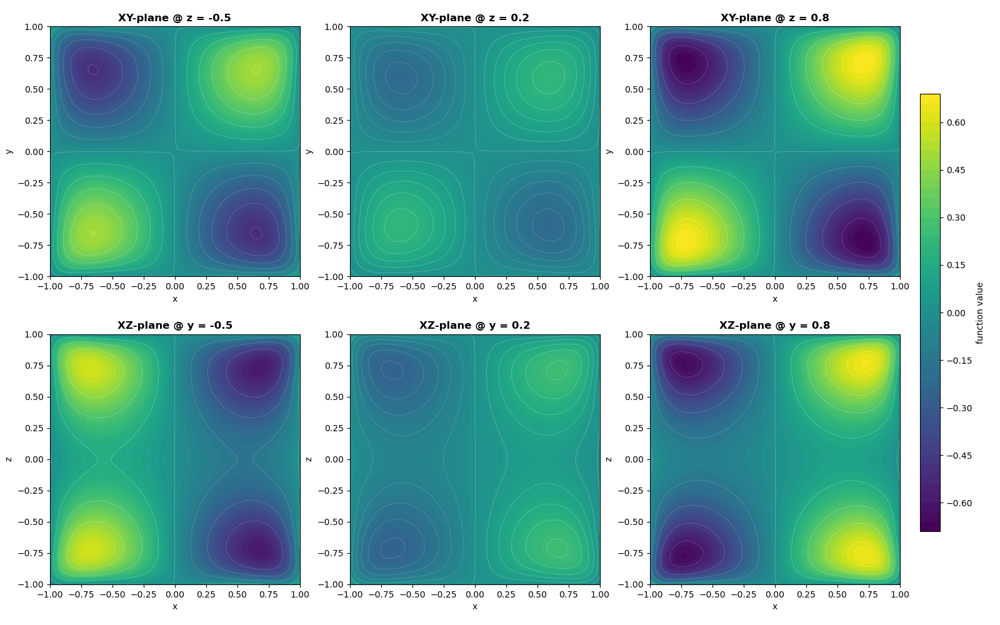

绘制该截面图的代码见`plot_evaluation.py`文件的`plot_ternary_function_advanced()`函数。<!--（名字长是因为它是大语言模型写的）-->

## 金标准的构建

当改变$\beta$的时候，边界条件残差和PDE残差具有此消彼长的关系。当改变模型超参数$w$和$h$的时候，边界条件残差和PDE残差通常也不会同步变化。因此，为了**衡量超参数的好坏**，我们需要计算预测解和**真解**之间的平方残差。

考虑定解问题

$$
\nabla^2\phi=-100xyz^2,\quad\phi|_{\partial[-1,1]^3}=0
$$

通过分离变量法，可以求得级数形式的严格解：

$$
\begin{align*}
\phi=\frac{25600}{\pi^5}
\sum_{l\in2\mathbb{Z}^+}
\sum_{m\in2\mathbb{Z}^+}
\sum_{n\in(2\mathbb{Z}^+-1)}
\left(1-\frac{8}{(n\pi)^2}\right)
\left(\frac{1}{lmn(l^2+m^2+n^2)}\right) \cdot\\
\sin\left(l\pi\cdot\frac{x+1}2\right)
\sin\left(m\pi\cdot\frac{y+1}2\right)
\sin\left(n\pi\cdot\frac{z+1}2\right)
\end{align*}
$$

我们在$(-1,1)^3$空间内，将每个坐标均分为100个点，得到总共1,000,000个点的立方格点；然后对这些格点计算截断后的上述三重无穷求和，截断位置为$l,m,n<100$，一共120,050项每格点；最后，我们将计算结果存储为`strict_solution_data.npz`，包含了所有1,000,000个格点的坐标和这些位置的级数求和。

<!-- 文件大小30.62MiB=30,000,000Byte=(1,000,000 points) * (3 coordinate + 1 potential) * (8 Byte per float number) -->

上述严格解计算代码，见`strict_solution.py`。

有了这些格点上函数的取值之后，我们就可以估计每一个模型与严格解之间的平方误差。

$$
\mathrm{error} = \sum_{\vec{p}} (\phi_{\mathrm{model}}(\vec{p})-\phi_{\mathrm{true}}(\vec{p}))^2
$$

需要注意：1.该误差与评分标准中的误差表达式有细微的差别；2.由于使用了截断的无穷级数估计$\phi_{\mathrm{true}}$，该误差并不严格，仅供参考。

调用Loss类评估已训练模型的PDE误差、边界误差，并计算上述平方误差的代码，见`loss_evaluation.py`。

## 搜索模型的最佳超参数

为了找到模型最佳的超参数，我首先实现了批量并行训练模型的代码。在`batch_train.py`中，我使用了`torch.multiprocessing.spawn`函数，向服务器的10块显卡分配训练任务，每个训练任务都指定了不同的$h,w,\beta$参数和随机数种子，但是训练轮数恒定为100,000。

然而，由于我没有使用多元函数优化算法进行系统性的优化，而是凭感觉在人工最优参数的可能取值的邻域内撒点，因此实际上找到的参数大概率不是严格最优的，只是一个较优的取值。

### 第一次搜索

为了大致寻找最优参数可能的范围，我以$(h=5,w\in\{128,512\},\beta=1)$ 为原点，向三个坐标轴的方向进行延伸搜索，以观察三个参数对模型损失的影响。见`batch_train.py`中`main_1()`函数。

---

当模型每层神经元个数$w$为128和512、$\beta=1$、隐藏层数$h$遍历2到9时，损失构成了如下曲线：

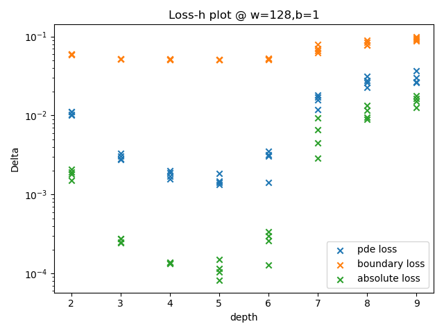
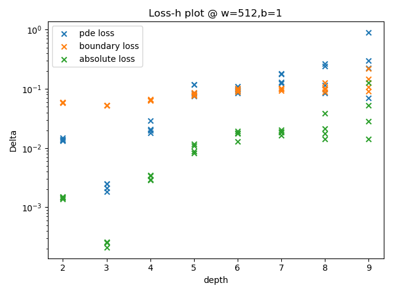

图中，绿色散点为平方误差。由该数据的变化趋势可以得出结论：

当每层神经元个数为128时，隐藏层数为5的模型表现最好，隐藏层数为4与6的模型次之，隐藏层数过深和过浅都会导致模型表现下降；

当每层神经元个数为512时，深度为3的模型表现最好，且远好于其它深度的模型。但此时模型的表现略逊于隐藏层数为5、神经元个数为128的模型。

---

当模型隐藏层数为5、$\beta=1$时，在32到768之间改变每层的神经元个数。结果如下：

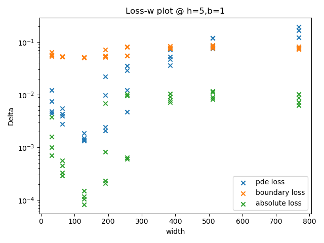

由此得出结论：当模型隐藏层数为5时，每层神经元个数为128的模型表现最好。

结合前一部分，我的第一次尝试就*恰好*击中了$\beta=1$平面上表现最好的参数组合。

---

当模型隐藏层数为5、每层神经元个数为128时，在$\beta\in(10^{-3},10^3)$的范围内改变$\beta$。结果如下：

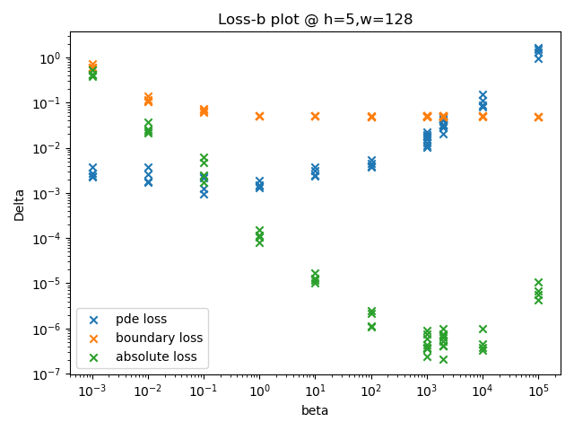

（图中$10^3,2\times10^3,10^4,10^5$四组数据点事实上是第二次搜索的结果。）

随着边界损失和PDE损失在总损失中的占比上升，首先边界损失剧烈下降后趋于平缓，然后PDE损失不再平缓并开始剧烈上升。

非常值得关注的一点是，平方损失最小的点并不在边界损失和PDE损失都趋于平缓的临界点$\beta\sim1$，而是在边界损失没有明显减小、但是PDE损失已经变大一个数量级的位置$\beta\sim2\times10^3$。

这意味着边界损失相较于PDE损失更加“重要”。这也意味着单靠PDE损失和边界损失，尽管可能可以优化出足够接近最优解的模型参数取值，也不足以让我们找到最优的超参数取值。

### 第二次搜索

在发现$\beta$的取值过小后，我使用了$\beta=10^3$进行了第二次搜索，同时更加细化了神经元个数$w$的搜索范围，对在3到6之间的隐藏层层数$h$与各自适宜的$w$进行更加细致的撒点。见`batch_train.py`中`main_2()`函数。

结果如下：

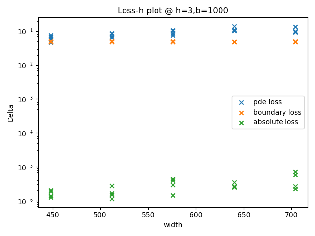
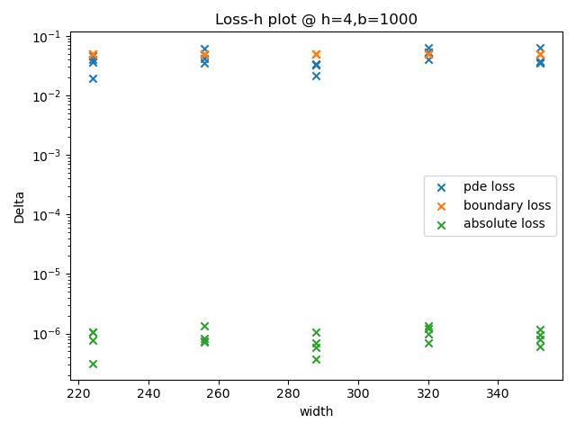
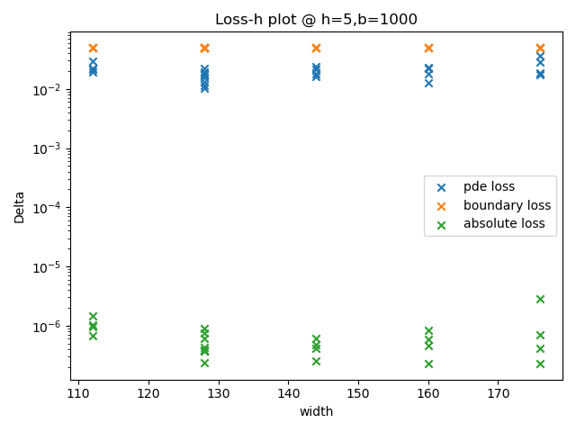
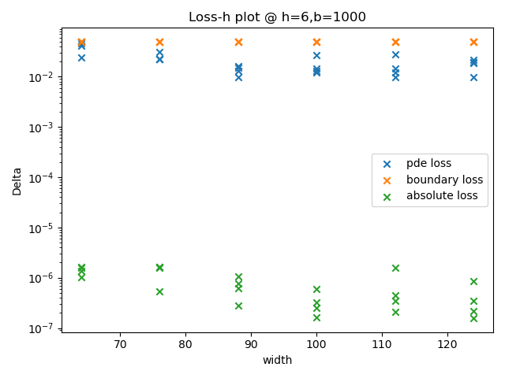

结果显示：当每层神经元个数在最优值附近时，该超参数对模型的表现没有显著影响。纵向比较上述四张图，当隐藏层层数$h=6$、每层神经元个数$w\approx100$附近时，模型的平方误差更小，但是变小得不明显。

此外，第二次搜索中，我还在(h=3,w=448)和(h=5,w=128)两个点附近搜索了$\beta$的更优取值。


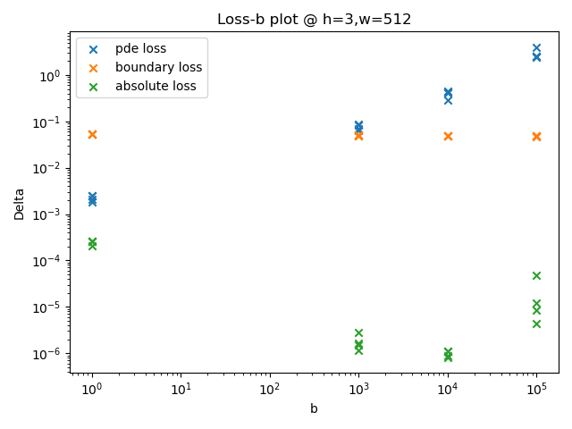

结果给出了两组较优参数组合：$(h=5,w=128,\beta=2\times10^3)$、$(h=3,w=448,\beta=\times10^4)$。我使用这两组参数组合训练了最终的模型，见`batch_train.py`中`main_3()`函数。

绘制本部分散点图的代码见`analysis_evaluation.py`。

## 总结

### 完成作业

- 模型设计：全连接层神经网络，使用tanh作为激活函数，隐藏层的宽度均为$w$；隐藏层层数为$h$。
- 损失函数：边界损失与PDE损失的线性组合，二者权重比为$\beta$。
- 训练集：域内采样点$N_p=10000$、边界采样点$N_b=6\times1000$，每轮重新采样。
- 测试集：不需要测试集。
- 优化器：默认参数的Adam优化器。
- 可视化方案：tensorboard网页截图、绘制多个截面内函数取值

### 追求更优

- 严格解估算：分离变量法得到无穷级数，将级数截断到100阶，计算在均匀立方格点上样本点的级数值。
- 搜索最佳参数：并行批量训练，手动选取训练参数，以与严格解的平方误差作为判断标准；(h=5,w=128,β=2000)(h=3,w=448,β=10,000)和(h=6,w=100,β=1000)都是比较好的超参数值。(题目中的β定义要取倒数)
