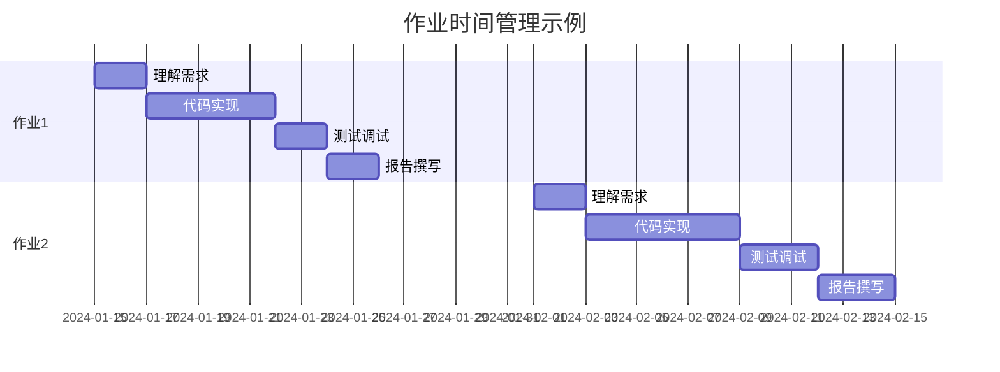

# 作业指南

欢迎来到AI x Physics课程的作业指南！本页面包含所有作业的详细信息、提交要求和评分标准。

## 📋 作业概览

本课程共有**4个主要作业**和**1个期末项目**，旨在帮助你巩固理论知识并提升实践能力。

### 作业列表

| 作业编号 | 作业名称 | 发布时间 | 截止时间 | 权重 |
|---------|----------|----------|----------|------|
| 作业1 | [基础概念与Python实践](/assignments/assignment-1) | 第2周 | 第4周周日 | 15% |
| 作业2 | [数据分析与可视化](/assignments/assignment-2) | 第5周 | 第7周周日 | 20% |
| 作业3 | [机器学习算法实现](/assignments/assignment-3) | 第8周 | 第10周周日 | 25% |
| 期末项目 | 综合项目 | 第13周 | 第16周周五 | 40% |

## 🎯 学习目标

通过完成这些作业，你将能够：
- 掌握Python科学计算的基本技能
- 理解并实现经典机器学习算法
- 分析和处理真实的物理数据
- 应用AI技术解决物理问题
- 撰写清晰的技术报告

## 📝 作业要求

### 通用要求

#### 代码质量
- **可读性**: 使用清晰的变量名和函数名
- **注释**: 为复杂逻辑添加必要的注释
- **结构**: 合理组织代码结构，避免重复
- **规范**: 遵循PEP 8 Python编码规范

#### 文档要求
- **Markdown报告**: 每个作业需提交详细的技术报告
- **结果分析**: 包含对结果的分析和讨论
- **参考文献**: 引用相关的论文和资料
- **图表**: 使用高质量的图表展示结果

#### 提交格式
```
assignment_X_姓名_学号/
├── README.md                 # 作业说明和运行指南
├── report.md                # 技术报告
├── notebooks/
│   ├── analysis.ipynb       # 主要分析notebook
│   └── experiments.ipynb    # 实验代码
├── src/
│   ├── utils.py             # 工具函数
│   ├── models.py            # 模型实现
│   └── visualization.py     # 可视化函数
├── data/
│   └── (数据文件或数据获取说明)
├── results/
│   ├── figures/             # 生成的图表
│   └── models/              # 训练好的模型
└── requirements.txt         # 依赖包列表
```

## 📊 评分标准

### 评分维度

#### 技术实现 (40%)
- 代码正确性和完整性
- 算法实现的准确性
- 代码效率和优化程度
- 错误处理和边界情况

#### 结果分析 (30%)
- 结果的准确性和合理性
- 数据可视化的质量
- 对结果的深入分析
- 与理论的结合程度

#### 报告质量 (20%)
- 文档的完整性和清晰度
- 技术细节的描述准确性
- 逻辑结构的合理性
- 语言表达的专业性

#### 创新性 (10%)
- 方法的创新性
- 额外的探索和实验
- 对问题的深入思考
- 超出基本要求的工作

### 评分等级

| 等级 | 分数范围 | 描述 |
|------|----------|------|
| A | 90-100 | 优秀：全面完成要求，有创新和深入思考 |
| B | 80-89 | 良好：完成主要要求，质量较高 |
| C | 70-79 | 中等：完成基本要求，存在一些问题 |
| D | 60-69 | 及格：部分完成要求，存在明显问题 |
| F | 0-59 | 不及格：未能完成基本要求 |

## ⏰ 时间管理

### 建议时间分配

#### 每个作业的时间分配
- **理解题目** (10%): 仔细阅读要求，理解目标
- **环境准备** (10%): 配置环境，准备数据
- **代码实现** (50%): 核心算法和功能实现
- **测试调试** (15%): 测试代码，修复bug
- **文档撰写** (15%): 写报告，整理代码

#### 时间安排建议


## 🤝 协作政策

### 允许的协作
- **讨论概念**: 可以与同学讨论理论概念和方法
- **调试帮助**: 可以请求帮助解决技术问题
- **资源分享**: 可以分享学习资源和参考资料
- **代码审查**: 可以请同学审查代码质量

### 禁止的行为
- **直接复制**: 不能直接复制他人代码
- **代写作业**: 不能请他人代写作业
- **答案分享**: 不能分享具体的解答过程
- **抄袭报告**: 不能抄袭他人的技术报告

### 引用规范
如果使用了他人的代码或想法，必须明确标注：
```python
# 参考来源：https://github.com/example/repo
# 作者：Example Author
# 修改：根据课程需求进行了适配
def example_function():
    pass
```

## 📤 提交方式

### 提交平台
作业通过[课程管理系统](https://lms.university.edu/ai4s)提交。

### 提交步骤
1. **打包文件**: 将作业文件夹压缩为zip格式
2. **命名规范**: `assignment_X_姓名_学号.zip`
3. **上传文件**: 在截止时间前上传到指定位置
4. **确认提交**: 检查提交状态和文件完整性

### 延迟政策
- **24小时内**: 扣除10%分数
- **48小时内**: 扣除20%分数
- **72小时内**: 扣除30%分数
- **超过72小时**: 扣除50%分数

### 特殊情况
如遇特殊情况无法按时提交，请提前联系助教说明情况。

## 🛠️ 技术支持

### 开发环境
- **推荐IDE**: VS Code, PyCharm, Jupyter Lab
- **版本控制**: Git (推荐使用GitHub)
- **Python版本**: 3.9+
- **包管理**: conda或pip

### 必需依赖
```bash
# 基础科学计算
numpy>=1.21.0
pandas>=1.3.0
matplotlib>=3.4.0
seaborn>=0.11.0
scipy>=1.7.0

# 机器学习
scikit-learn>=1.0.0
tensorflow>=2.8.0
torch>=1.11.0
```

### 获取帮助
1. **查阅文档**: 首先查看课程文档和API文档
2. **搜索错误**: 在Google或Stack Overflow搜索错误信息
3. **课程论坛**: 在课程论坛发帖求助
4. **助教答疑**: 参加定期的答疑时间
5. **邮件联系**: 发邮件给助教（非紧急情况）

## 📈 提升建议

### 代码质量提升
- 使用代码格式化工具（black, autopep8）
- 编写单元测试验证功能
- 使用类型提示提高代码可读性
- 定期重构优化代码结构

### 学习资源
- **在线教程**: [Python科学计算教程](https://python-course.eu/)
- **文档资源**: [NumPy用户指南](https://numpy.org/doc/)
- **视频课程**: [机器学习实战](https://coursera.org/ml)
- **参考书籍**: 见[推荐书籍页面](/resources/books)

## 🎓 学术诚信

### 诚信原则
- 独立完成作业，诚实报告结果
- 正确引用他人工作和想法
- 不参与任何形式的作弊行为
- 发现问题及时向老师报告

### 后果说明
违反学术诚信的行为将导致：
- 该作业得0分
- 课程总成绩降级
- 学术诚信调查
- 可能的纪律处分

---

*记住：作业不仅是评估工具，更是学习的重要途径。通过认真完成作业，你将获得宝贵的实践经验！*
