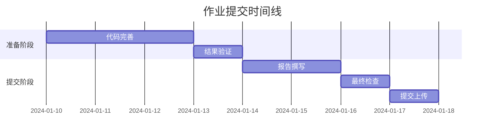

# 作业提交方式

本页面详细说明了课程作业的提交方式、要求和注意事项。请仔细阅读并严格按照要求提交。

## 📤 提交平台

### 主要平台
- **LMS系统**: [https://lms.university.edu/ai4s](https://lms.university.edu/ai4s)
- **备用平台**: GitHub Classroom (用于代码管理)
- **紧急联系**: ai4s-submit@university.edu

### 平台功能
- 在线提交和管理作业
- 自动查重和相似度检测
- 成绩查看和反馈
- 提交历史记录

## 📁 文件组织规范

### 标准目录结构
```
assignment_X_姓名_学号/
├── README.md                    # 必需：作业说明
├── report.pdf                  # 必需：技术报告(PDF格式)
├── report.md                   # 可选：Markdown原文
├── notebooks/                  # 必需：Jupyter notebooks
│   ├── main_analysis.ipynb     # 主要分析文件
│   ├── data_exploration.ipynb  # 数据探索(如适用)
│   └── experiments.ipynb       # 实验代码(如适用)
├── src/                        # 推荐：源代码文件
│   ├── __init__.py
│   ├── utils.py                # 工具函数
│   ├── models.py               # 模型实现
│   ├── data_processing.py      # 数据处理
│   └── visualization.py        # 可视化函数
├── data/                       # 数据文件或说明
│   ├── raw/                    # 原始数据
│   ├── processed/              # 处理后数据
│   └── README.md               # 数据说明
├── results/                    # 结果文件
│   ├── figures/                # 图表文件
│   ├── models/                 # 训练好的模型
│   └── outputs/                # 其他输出文件
├── requirements.txt            # Python依赖包
├── environment.yml             # Conda环境(可选)
└── .gitignore                  # Git忽略文件(可选)
```

### 文件命名规范
- **文件夹**: `assignment_X_姓名_学号` (X为作业编号)
- **报告**: `report.pdf` 或 `report.md`
- **主notebook**: `main_analysis.ipynb`
- **压缩包**: `assignment_X_姓名_学号.zip`

## 📝 必需文件详解

### README.md
```markdown
# 作业X - [作业标题]

**学生**: 张三  
**学号**: 2024001234  
**提交日期**: 2024-XX-XX

## 作业概述
简要描述本次作业的内容和目标。

## 环境要求
- Python 3.9+
- 所需库列表（或参考requirements.txt）

## 运行指南
1. 安装依赖: `pip install -r requirements.txt`
2. 运行主要分析: 打开并运行 `notebooks/main_analysis.ipynb`
3. 查看结果: 结果保存在 `results/` 目录下

## 文件说明
- `notebooks/main_analysis.ipynb`: 主要分析代码
- `src/utils.py`: 工具函数
- `report.pdf`: 详细技术报告

## 主要发现
简要总结主要结果和发现。

## 问题记录
记录遇到的主要问题和解决方案。
```

### 技术报告要求
报告应包含以下部分：

#### 1. 摘要 (Abstract)
- 问题描述
- 方法概述
- 主要结果
- 结论

#### 2. 引言 (Introduction)
- 背景介绍
- 问题定义
- 研究目标
- 相关工作

#### 3. 方法 (Methodology)
- 数据描述
- 算法选择和实现
- 实验设计
- 评估指标

#### 4. 结果 (Results)
- 实验结果展示
- 图表分析
- 性能评估
- 对比分析

#### 5. 讨论 (Discussion)
- 结果分析
- 优缺点讨论
- 改进建议
- 局限性分析

#### 6. 结论 (Conclusion)
- 主要贡献
- 未来工作
- 学习收获

#### 7. 参考文献 (References)
- 使用标准学术引用格式
- 包含所有参考的论文、书籍、网站

## 📋 提交检查清单

### 提交前检查
- [ ] **完整性检查**
  - [ ] 所有必需文件已包含
  - [ ] 代码能够正常运行
  - [ ] 结果文件已生成
  - [ ] 报告内容完整

- [ ] **质量检查**
  - [ ] 代码添加了适当注释
  - [ ] 图表清晰且有标题
  - [ ] 报告没有拼写错误
  - [ ] 引用格式正确

- [ ] **格式检查**
  - [ ] 文件命名符合规范
  - [ ] 目录结构正确
  - [ ] 压缩包大小合理(<100MB)
  - [ ] README.md文件完整

### 技术检查
```python
# 运行此脚本检查环境和依赖
import sys
import os
import subprocess

def check_submission():
    print("=== 提交检查工具 ===")
    
    # 检查Python版本
    print(f"Python版本: {sys.version}")
    
    # 检查必需包
    required_packages = [
        'numpy', 'pandas', 'matplotlib', 
        'seaborn', 'scikit-learn'
    ]
    
    for package in required_packages:
        try:
            __import__(package)
            print(f"✅ {package}: 已安装")
        except ImportError:
            print(f"❌ {package}: 未安装")
    
    # 检查文件结构
    required_files = [
        'README.md', 'report.pdf', 
        'notebooks/main_analysis.ipynb'
    ]
    
    for file in required_files:
        if os.path.exists(file):
            print(f"✅ {file}: 存在")
        else:
            print(f"❌ {file}: 缺失")
    
    print("=== 检查完成 ===")

if __name__ == "__main__":
    check_submission()
```

## 🚀 提交流程

### 步骤1: 最终整理
1. 确保所有代码都能正常运行
2. 生成最终的结果文件
3. 完成技术报告
4. 运行提交检查脚本

### 步骤2: 打包文件
```bash
# 创建压缩包
zip -r assignment_X_姓名_学号.zip assignment_X_姓名_学号/

# 检查压缩包内容
unzip -l assignment_X_姓名_学号.zip
```

### 步骤3: 在线提交
1. 登录LMS系统
2. 找到对应的作业提交页面
3. 上传压缩文件
4. 填写提交说明
5. 确认提交

### 步骤4: 提交确认
- 检查提交状态
- 保存提交确认截图
- 记录提交时间

## ⏰ 时间安排

### 提交时间线


### 建议时间分配
- **提交前3天**: 完成代码和实验
- **提交前2天**: 撰写技术报告
- **提交前1天**: 最终检查和打包
- **截止日当天**: 早上提交，避免最后时刻

## 🔄 版本控制

### Git使用建议
```bash
# 初始化仓库
git init
git add .
git commit -m "Initial commit"

# 定期提交
git add .
git commit -m "完成数据分析部分"

# 创建提交版本
git tag v1.0 -m "最终提交版本"
```

### GitHub提交
如果使用GitHub Classroom：
```bash
# 推送到远程仓库
git remote add origin https://github.com/ai4s-course/assignment-X-username.git
git push -u origin main
git push --tags
```

## 📊 提交统计

### 成功提交标准
- 文件完整且格式正确
- 代码能够正常运行
- 结果合理且分析到位
- 报告结构清晰完整

### 常见问题
1. **文件缺失** (30%): 忘记包含必需文件
2. **代码错误** (25%): 代码无法运行
3. **格式问题** (20%): 文件命名或结构不规范
4. **迟交** (15%): 超过截止时间
5. **其他** (10%): 其他技术问题

## 🆘 紧急情况处理

### 技术故障
如遇技术问题无法正常提交：
1. 立即发邮件给助教说明情况
2. 提供问题截图和错误信息
3. 将作业文件作为邮件附件发送
4. 等待进一步指导

### 系统维护
如遇系统维护：
- 关注课程通知
- 使用备用提交邮箱
- 保留所有提交证据

### 联系方式
- **紧急邮箱**: ai4s-emergency@university.edu
- **助教电话**: (仅限紧急情况)
- **课程群**: 实时沟通和互助

## 📈 提交质量提升

### 优秀提交示例
可以参考往年优秀作业：
- [示例作业1](https://github.com/ai4s-course/examples/assignment-1)
- [示例作业2](https://github.com/ai4s-course/examples/assignment-2)

### 评分加分项
- 代码结构清晰且有良好注释
- 使用先进的可视化技术
- 深入的结果分析和讨论
- 创新的方法或见解

---

*记住：提交是学习过程的最后一步，但也是最重要的一步。认真对待每一次提交！*
