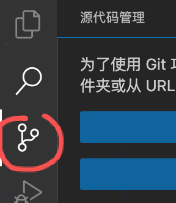
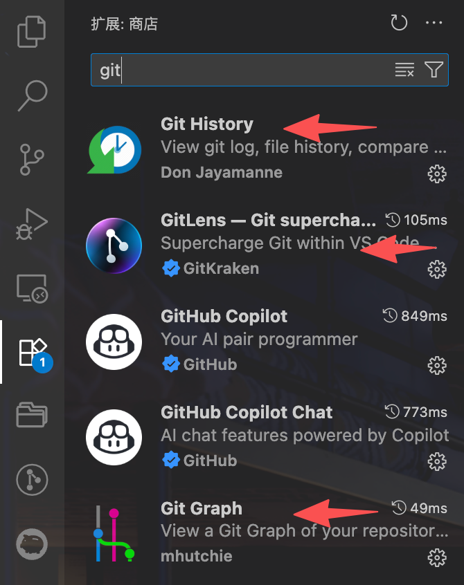
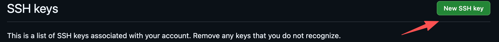
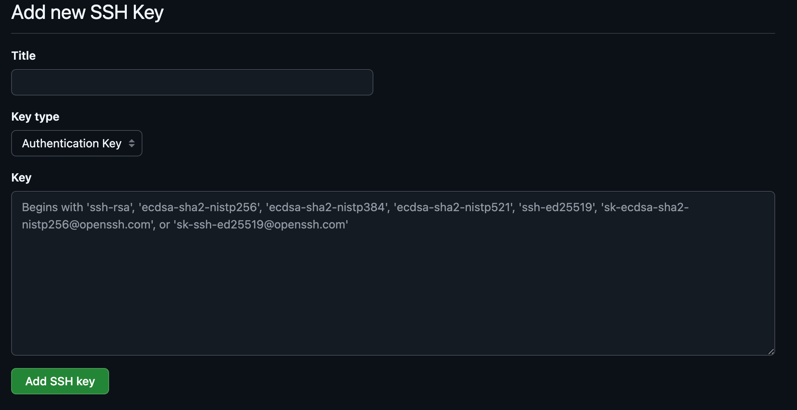
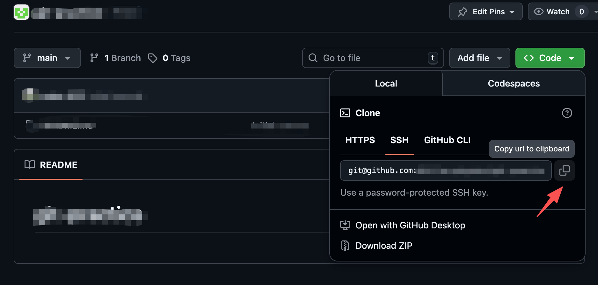
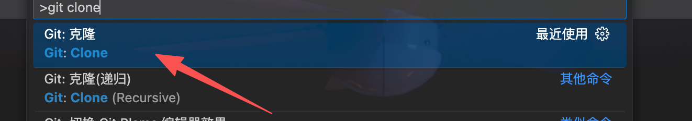
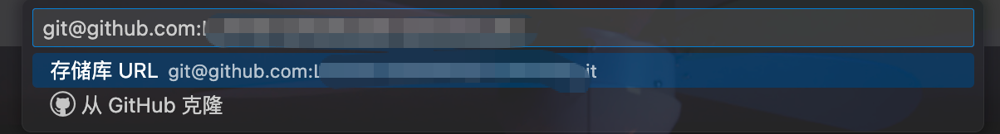
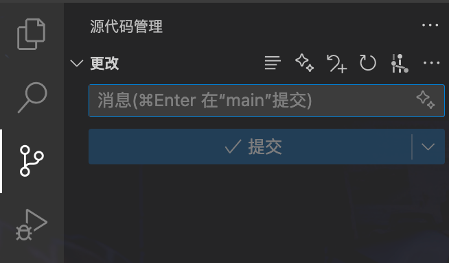

# Git 基础及其在vscode中的可视化操作

想象一下你在玩一个高难度的游戏，马上就要挑战最终 BOSS 了。在挑战前，你一定会先“存档”，对吗？这样，即使挑战失败，你也可以随时读档，回到挑战前的最佳状态，而不用从头再来。

在编程世界里，Git 就是你代码的“存档”工具。当你辛辛苦苦写完一个功能，或者准备尝试一个大胆的新想法时，如果一不小心把事情搞砸了——比如代码崩溃了，或者新功能还不如旧的好用——你可能会希望能回到修改前的样子。如果没有 Git，你可能只能凭记忆一点点往回改，这无疑是一场噩噩梦。

Git，作为一个强大的**版本控制系统**，就是为了解决这个问题而生的。它能帮你记录每一次代码的“快照”，让你可以在任意时刻“读档”，回到过去任何一个你保存过的状态。

**本教程旨在针对git的基础知识及其在vscode中的可视化操作进行介绍。**

## 准备工作

### 安装git

- 在MacOS中，git应该是默认已经被安装了，可以通过`git -v`确认；
- 在Windows中，git需要自行安装（比较容易，可以参考网络上的各种教程，这里不再重复）。
- 在Linux中，git有可能没有默认安装，可以通过`git -v`确认；如果发现确实还没安装，可以通过`sudo apt install git`来安装。

### git的基本配置

本地安装完成后，在终端中通过如下两条命令配置用户名和邮箱：

```
git config --global user.name "your name"
git config --global user.email "your email"
```

其中your name和your email填入自己的昵称和邮箱即可。

### Vscode中的git功能

vscode自身已经集成了必要的git功能，可以点击界面左侧如下图标查看（Windows中，如果还没有安装过git，那么在点击vscode的git功能界面时，会提供一个一键安装的按钮）：



此外，还有一些非常好用的git插件推荐安装。它们可以提升我们在vscode中使用git的体验和效率，比如git history、gitlens和git graph，它们都可以在vscode的插件市场中搜索并安装：



### 从GitHub上clone一个代码仓库

GitHub上有很多开源项目。通常，我们科研、学习中与人合作用到的代码仓库也会以暂时闭源的方式托管在GitHub上。市面上还有一些其他的代码托管平台，比如gitee、gitlab等。它们的操作逻辑很相似，我们以GitHub为例。

- **在GitHub中上传SSH密钥（可选）**：如果网络环境不稳定，通过默认的html方式克隆（clone，意思是把仓库拉取到本地） GitHub上的项目可能会失败。因此，可以将本地的ssh公钥（获取方式详见登陆服务器并配置免密登陆的有关说明）上传到GitHub自己的账户下。具体操作方式是：登陆GitHub账号--点击右上角个人头像--选择“设置（settings）”--在跳转到的页面左侧的菜单栏选择“access”下的“SSH and GPG keys”--在跳转到的页面右上方点击“New SSH key”--在跳转到的页面中填写用于区分这个key的标题，然后将本地的ssh公钥复制粘贴到“Key”下--点击“Add SSH key”即可。完成后，本地通过运行`ssh -T git@github.com`，可以建立并确认本地与GitHub的链接（正常的返回结果如“Hi XXX! You've successfully authenticated, but GitHub does not provide shell access.”）。

  

  

- 打开一个GitHub仓库的链接，进入该仓库，点击“Code”，选择某种clone方式（比如SSH），然后点击后面的复制按钮，复制clone该仓库所需的链接。

  

- 在Vscode中，按下`Ctrl (MacOS为Command) + Shift + P`，在Vscode上方弹出的对话框中输入`git clone`，选择"Git: Clone"，再进一步弹出的新对话框中粘贴该链接（不用管那个“从GitHub克隆”），然后回车确认。接下来会弹出窗口，选择希望将该仓库保存在本地的位置即可。开始克隆后，右下角会有进度提示。克隆完成后，会弹出窗口询问是否打开该仓库，选择打开即可。

  

  

- 现在，在vscode界面中，你已经打开了刚才克隆的项目。此时如果点击界面左侧的git图标，应该可以看到类似下面的效果：
  

## Git是如何工作的？

为了理解 Git，我们需要先了解它的几个核心概念。你可以把它们想象成一个既高效又严谨的办公室工作流程。

### 核心三区：你的个人办公室

首先，我们关注你自己的工作空间，这里有三个核心区域：

1.  **工作区 (Working Directory)**：这是你的办公桌。所有你当前正在编辑、修改的文件都在这里。这是你进行创造和修改的实时区域，一切都还处于草稿阶段。

1.  **暂存区 (Staging Area)**：这是你办公桌上的一个“待归档”文件盒。当你完成了一部分修改（比如修复了一个 bug，或完成了某个小功能），你觉得这部分工作可以告一段落了，就把修改过的文件放进这个盒子里。这个动作（`git add`）就像是在说：“这个文件的这版修改，我确认没问题了，准备将它正式存档。” 暂存区让你能够精确地选择哪些改动要被包含在下一次的正式存档中。

1.  **版本库 (Repository)**：这是你办公室里那个巨大的、永不丢失的档案柜。当你觉得“待归档”文件盒里的东西都准备好了，你就可以执行“**提交 (commit)**”操作。这个操作会：
    *   把暂存区里所有的文件制作成一个永久的“快照”（一个版本）。
    *   为这个快照贴上一个唯一的编号（Commit ID）和一张详细的标签（Commit Message，比如“v1.0，修复了登录 bug”）。
    *   将这个贴好标签的快照永久地存入档案柜。

这个流程可以总结为：

1.  在**工作区**修改你的文件。
1.  将修改完成的文件**暂存(stage)**起来 (`git add`)。
1.  将暂存区的所有内容**提交(commit)**到**版本库**，形成一个新版本 (`git commit`)。

注意，暂存区的文件还可以退回工作区，变回待暂存的状态；而版本库中一般不行（除非在一些特殊情境下）。

### 更进一步：分支、远端与协作

现在，我们的办公室工作流程已经很顺畅了。但如果需要同时处理多个任务，或者要和同事协作呢？这就需要引入更强大的概念。

#### 分支 (Branch) 

想象一下，你正在档案柜的上稳定地推进工作。突然，你需要开发一个实验性的新功能，但又不想弄乱主线上已有的、稳定的工作成果。怎么办？或者，对于一个多人协作开发的项目，为了保证开发的安全性，通常也要确保不同的开发者在不同的分支上工作。

**分支**就像是给你的项目开启了一个“平行时空”。每个分支都由一系列提交版本（commit记录）构成。

*   **创建分支**：这个操作相当于你以某次提交对应的版本为基础，把该版本完整地复制了一份。
*   **切换分支**：你每个时刻只能处在一个分支上。
*   **合并分支**：将两个不同的分支中的内容合并到一起。这里面最为复杂的问题在于潜在的代码冲突的处理。这属于进阶操作，这里暂不介绍。

#### 提交 (Commit) 的本质 - 历史的基石

我们之前说提交是“快照”。更精确地说，**每一个提交都是一个指向前一个提交的快照**。

这就在你的档案柜里形成了一条清晰的时间线。当你创建一个分支时，你只是在当前的时间点上，新建了一个不同的“未来”指针。Git 就是通过追踪这些由提交串联起来的链条，来管理复杂的项目历史的。

#### 本地与远端 (Local & Remote) - 与团队协作

到目前为止，我们讨论的办公桌、文件盒、档案柜，全都是你一个人的，这被称为**本地版本库 (Local Repository)**。

但项目通常是团队合作的。因此，我们需要一个中央办公室，或者说一个云端共享档案室，这就是**远端版本库 (Remote Repository)**，比如 GitHub、GitLab 上的项目。

*   **你的办公室 = 本地版本库 (Local Repo)**：包含了项目的完整历史。你可以在这里进行任意的提交、创建分支，即使断网了也没关系。
*   **中央档案室 = 远端版本库 (Remote Repo)**：团队成员共享的官方版本。它是所有人同步工作的基准。

协作流程就变成了：

1.  **克隆 (`git clone`)**：新加入团队时，你把中央档案室的所有内容完整地复制一份，在你的电脑上建立起你自己的本地办公室。
1.  **拉取 (`git pull`)**：每天开始工作前，先从中央档案室同步一下最新的文件，看看同事们有没有更新。这相当于 `git fetch`（查看远端有什么新东西）+ `git merge`（把新东西合并到你的本地版本）。
1.  **推送 (`git push`)**：当你完成了一个功能，并在你的本地档案柜里提交了，你就可以把它“推送”到中央档案室，与团队成员分享你的工作成果。没有推送到远端的分支/提交，合作者是看不到的，只有你自己本地能看到。

最后要强调，在git开发过程中，必须时刻清楚哪些分支/提交是只存在于本地的，哪些分支/提交是已经同步到远端的了。

## 基础使用

使用 Git 的第一步是先编辑本地的一些提交信息。Git 的提交需要一个用户名和一个邮箱，来对应每次提交的作者。我们可以使用以下命令来设置这些信息：

```bash
git config --global user.name "Your Name"
git config --global user.email "email@example.com"
```

虽然我们主要通过命令行来学习 Git 的核心概念，但在日常开发中，我们强烈推荐使用图形化界面工具来辅助版本控制。Visual Studio Code 内置了强大的 Git 支持，你可以通过其侧边栏的“源代码管理”视图轻松地查看文件状态、暂存更改、提交版本，甚至解决冲突，极大地提高了工作效率。

此外，Git 本身是一个分布式的版本控制系统，但为了方便团队协作和代码备份，我们通常会使用像 GitHub、GitLab 或 Gitee 这样的代码托管平台。这些平台为你的本地 Git 仓库提供了一个远程的“家”，你可以将本地的提交推送到远程服务器，也可以从远程服务器拉取他人的更新。这使得多人协作开发变得简单而高效。

## 版本控制：提交

接下来，让我们通过一个具体的例子来体验一下 Git 的完整流程。假设我们要创建一个简单的 Python 项目。

1.  **创建项目目录并初始化仓库**

首先，我们创建一个名为 `hello-git` 的文件夹，并进入该文件夹。

```bash
mkdir hello-git
cd hello-git
```

然后，我们使用 `git init` 命令来初始化一个新的 Git 仓库。

```bash
git init
```

你会看到类似这样的输出，表示一个空的 Git 仓库已经创建好了：

```
Initialized empty Git repository in /path/to/your/hello-git/.git/
```

2.  **创建文件并进行第一次提交**

现在，让我们在项目里创建一个 `hello.py` 文件：

```python
# hello.py
print("Hello, Git!")
```

我们可以使用 `git status` 命令来查看当前仓库的状态：

```bash
git status
```

Git 会告诉我们，有一个“未暂存”的文件 `hello.py`：

```
On branch master

No commits yet

Untracked files:
  (use "git add <file>..." to include in what will be committed)
        hello.py

nothing added to commit but untracked files present (use "git add" to track)
```

接下来，我们使用 `git add` 命令将这个文件添加到暂存区：

```bash
git add hello.py
```

再次运行 `git status`，你会发现 `hello.py` 已经从“未暂存”变成了“待提交”：

```
On branch master

No commits yet

Changes to be committed:
  (use "git rm --cached <file>..." to unstage)
        new file:   hello.py
```

最后，我们使用 `git commit` 命令，将暂存区的内容提交到版本库，并附上一条有意义的提交信息：

```bash
git commit -m "Initial commit: Add hello.py"
```

现在，我们的第一个版本就已经被永久保存下来了！再次运行 `git status`，Git 会告诉我们工作区是干净的，没有什么需要提交的了。

3.  **修改文件并提交新版本**

现在，我们来修改一下 `hello.py`：

```python
# hello.py
print("Hello, Git!")
print("This is the second version.")
```

再次运行 `git status`，Git 会检测到文件的改动：

```
On branch master
Changes not staged for commit:
  (use "git add <file>..." to update what will be committed)
  (use "git restore <file>..." to discard changes in working directory)
        modified:   hello.py

no changes added to commit (use "git add" and/or "git commit -a")
```

我们可以使用 `git diff` 命令来查看具体的修改内容：

```diff
- print("Hello, Git!")
+ print("Hello, Git!")
+ print("This is the second version.")
```

和之前一样，我们先把修改过的文件添加到暂存区，然后再提交：

```bash
git add hello.py
git commit -m "Update hello.py with a new line"
```

## 版本控制：回退

有时候，我们可能需要回到过去某个特定的版本，无论是为了查看当时的代码，还是彻底放弃当前的修改。Git 提供了强大的工具来帮助我们实现“代码回溯”。

### 查看提交历史 (`git log`)

在回退之前，我们首先需要知道我们想回退到哪个版本。`git log` 命令可以帮助我们查看所有的提交历史。

```bash
git log
```

它会按时间倒序列出所有的提交记录，包括每个提交的唯一哈希值（commit hash）、作者、日期和提交信息。

```
commit a1b2c3d4e5f6a7b8c9d0e1f2a3b4c5d6e7f8g9h0 (HEAD -> master)
Author: Your Name <email@example.com>
Date:   ...

    Update hello.py with a new line

commit 1a2b3c4d5e6f7a8b9c0d1e2f3a4b5c6d7e8f9g0h
Author: Your Name <email@example.com>
Date:   ...

    Initial commit: Add hello.py
```

这个长长的、由字母和数字组成的字符串就是**commit hash**，它是每个版本的唯一身份证。在回退版本时，我们通常只需要使用它的前几位（比如前 7 位 `a1b2c3d`）就足够了。

### 回退版本 (`git reset`)

`git reset` 是 Git 的“时光机”中最强大的命令之一。它可以将你的项目回退到指定的版本。它有三种主要的模式：`--soft`、`--mixed`（默认）和 `--hard`。

为了理解这三种模式的区别，我们再次回顾 Git 的三个核心区域：**工作区**、**暂存区**和**版本库**。

假设我们的提交历史是 `A -> B -> C`，当前在 `C` 版本。我们现在想回退到 `B` 版本 (`git reset B`)。

1. `--hard` 模式：彻底回退

这是最彻底、也是最“危险”的回退模式。它会完全丢弃回退点之后的所有改动。

```bash
git reset --hard <commit_hash>
```

**执行效果**：

*   **版本库**：从 `C` 回退到 `B`。
*   **暂存区**：内容被清空，与 `B` 版本保持一致。
*   **工作区**：所有文件都被强制恢复到 `B` 版本时的状态。你在 `C` 版本所做的所有修改（包括 `hello.py` 中新增的那一行）都会**彻底消失**。

**适用场景**：当你确定要完全放弃某个版本之后的所有修改时使用。**请谨慎使用，因为工作区的修改将无法恢复！**

**示例**：

```bash
# 假设 B 版本的 commit hash 是 1a2b3c4
git reset --hard 1a2b3c4
```

2. `--mixed` 模式：保留工作区修改

这是 `git reset` 的默认模式。如果你不指定任何模式，它就会使用 `--mixed`。

```bash
git reset <commit_hash>
# 或者
git reset --mixed <commit_hash>
```

**执行效果**：

*   **版本库**：从 `C` 回退到 `B`。
*   **暂存区**：内容被清空，与 `B` 版本保持一致。
*   **工作区**：**保持不变**。你在 `C` 版本所做的修改（`hello.py` 中新增的那一行）会**依然存在**于你的文件中，但这些修改会处于“未暂存”状态。

**适用场景**：当你想要撤销某次提交，但又想保留那次提交所做的代码改动，以便重新修改和提交时使用。

**示例**：

```bash
git reset 1a2b3c4
```

执行后，运行 `git status`，你会看到 `hello.py` 显示为“modified”，就像你刚刚修改完但还没 `git add` 一样。

1. `--soft` 模式：保留工作区和暂存区

这是最“温和”的回退模式。

```bash
git reset --soft <commit_hash>
```

**执行效果**：

*   **版本库**：从 `C` 回退到 `B`。
*   **暂存区**：**保持不变**。`C` 版本所做的修改会依然存在于暂存区中。
*   **工作区**：**保持不变**。

**适用场景**：当你觉得上一次的提交信息写得不好，或者想把上一次的提交内容和新的修改合并成一次提交时使用。

## 版本控制：忽略特定文件 (`.gitignore`)

在我们的项目中，并非所有文件都适合纳入版本控制。例如，编译产生的文件、日志文件或包含密码等敏感信息的文件，都不应该提交到代码库中。

为了让 Git 自动忽略这些文件，我们可以在项目的根目录下创建一个名为 `.gitignore` 的特殊文件。在文件中，我们可以列出不希望被 Git 跟踪的文件或目录。

### `.gitignore` 示例

假设我们不希望跟踪任何 `.log` 文件和 `temp/` 目录下的所有内容，我们可以创建一个 `.gitignore` 文件，并写入以下内容：

```gitignore
# 忽略所有 .log 文件
*.log

# 忽略 temp/ 目录
temp/
```

创建好 `.gitignore` 文件后，记得将它本身添加到 Git 仓库中，这样团队成员就能共享同一套忽略规则了。

```bash
git add .gitignore
git commit -m "Add .gitignore"
```

**注意**：`.gitignore` 只能忽略那些从未被跟踪过的文件。如果某个文件已经被纳入了版本库，你需要先从版本库中删除它 (`git rm --cached <file>`)，然后再将其加入 `.gitignore`。

关于 Git 版本控制的一些更加进阶的知识（例如分支管理等内容），欢迎查阅更多资料。 我们在高阶课程7.1中会介绍一些 Git 的进阶用法。

## 远程仓库与协作

到目前为止，我们所有的操作都只在本地的 Git 仓库中进行。但 Git 的真正威力在于其分布式协作的能力。通过将本地仓库与一个**远程仓库**（通常托管在 GitHub、GitLab 或 Gitee 等平台上）关联，我们可以实现代码的备份、分享和团队协作。

### 关联远程仓库

首先，你需要在代码托管平台上创建一个新的空仓库。创建完成后，平台会为你提供一个远程仓库的地址（URL）。这个地址通常有两种形式：HTTPS 和 SSH。

1.  **HTTPS 方式**：
    -   URL 类似于 `https://github.com/username/repository.git`。
    -   每次推送（push）或拉取（pull）时，通常需要输入用户名和密码（或者使用 Personal Access Token）。
    -   优点是设置简单，在任何网络环境下都能工作。

1.  **SSH 方式**：
    -   URL 类似于 `git@github.com:username/repository.git`。
    -   需要预先在你的电脑上生成 SSH 密钥对，并将公钥添加到代码托管平台的账户设置中。
    -   优点是配置完成后，不再需要重复输入密码，更加安全和方便。关于如何配置 SSH，可以参考 [SSH 身份验证](./ssh.md) 章节。

假设我们已经有了一个远程仓库地址，我们可以使用 `git remote add` 命令将它与我们的本地仓库关联起来。通常，我们会将这个远程仓库命名为 `origin`。

```bash
# 使用 HTTPS
git remote add origin https://github.com/username/repository.git

# 或者使用 SSH
git remote add origin git@github.com:username/repository.git
```

### 推送与拉取

- **推送 (`git push`)**：将本地的提交推送到远程仓库。

  ```bash
  # 将本地的 master 分支推送到 origin 远程仓库
  git push -u origin master
  ```

  `-u` 参数会将本地的 `master` 分支与远程的 `master` 分支关联起来，这样以后你就可以直接使用 `git push` 命令了。

- **拉取 (`git pull`)**：从远程仓库获取最新的版本，并与本地分支合并。

  ```bash
  git pull origin master
  ```

- **克隆 (`git clone`)**：如果你想获取一个已存在的远程仓库到本地，可以使用 `git clone` 命令。这会自动将远程仓库克隆到你的电脑上，并自动设置好 `origin`。

  ```bash
  # 使用 HTTPS
  git clone https://github.com/username/repository.git
  
  # 使用 SSH
  git clone git@github.com:username/repository.git
  ```