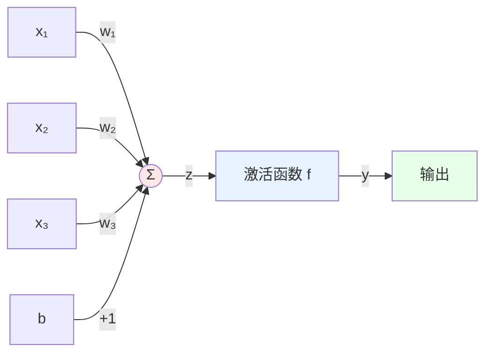
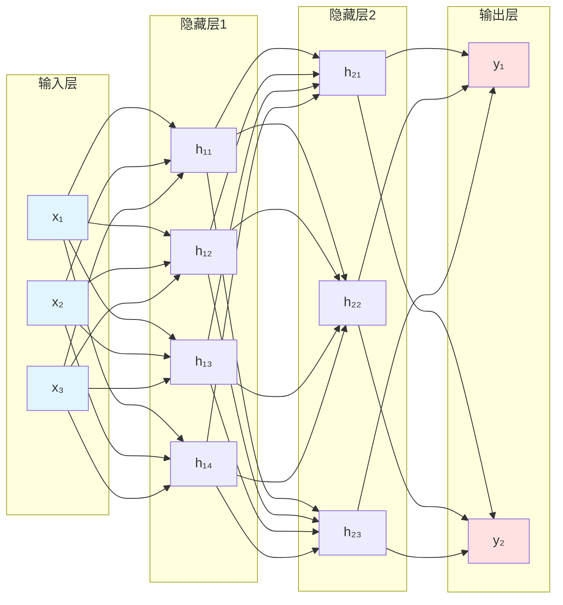
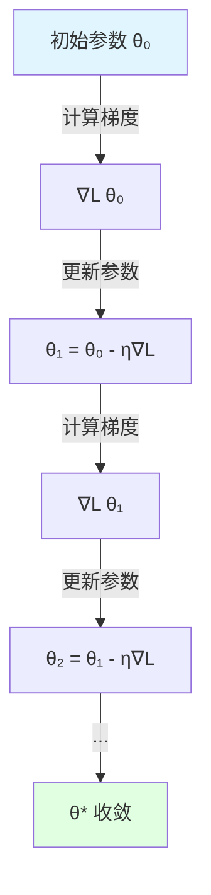
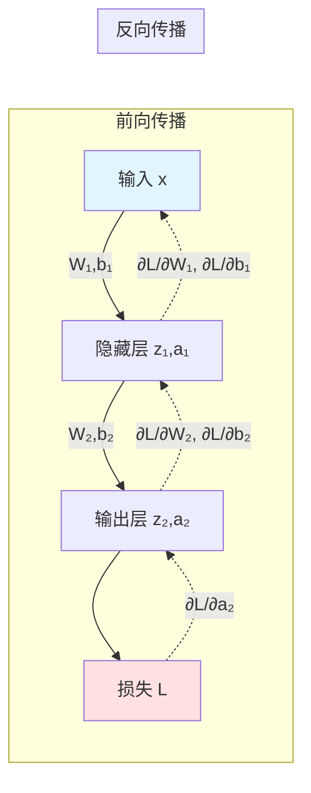
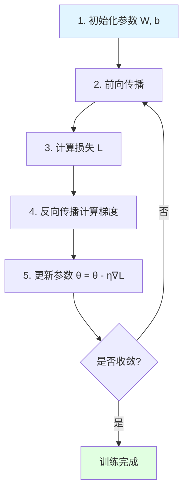
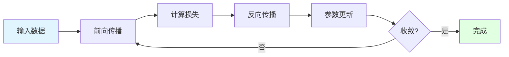

# 神经网络基础教程

## 1. 简介：什么是神经网络？

### 1.1 灵感来源：生物神经元

神经网络的概念最初来源于对生物神经系统的研究。在我们的大脑中，神经元通过突触连接形成复杂的网络。每个神经元：
- 通过树突接收来自其他神经元的信号
- 在细胞体中处理这些信号
- 如果信号强度超过某个阈值，神经元会被激活
- 通过轴突向其他神经元传递信号

### 1.2 机器学习中的神经网络

在机器学习中，我们将这一生物过程抽象为数学模型。神经网络本质上是一个**可以从数据中学习的复杂函数**：

$$f: \mathbb{R}^n \rightarrow \mathbb{R}^m$$

它接收输入数据（例如图像的像素值），通过多层计算，最终输出预测结果（例如图像的分类标签）。

## 2. 神经网络的基本单元：神经元

### 2.1 数学模型

一个人工神经元（也称为感知机 Perceptron）是神经网络的基本计算单元。它接收多个输入，并产生一个输出。

**输入与参数**：
- 输入：$x_1, x_2, \dots, x_n$
- 权重：$w_1, w_2, \dots, w_n$（每个输入对应一个权重）
- 偏置：$b$（一个常数项）

### 2.2 计算过程

神经元的计算分为两个步骤：

**步骤 1：线性组合**

计算所有输入的加权和，再加上偏置：

$$z = w_1 x_1 + w_2 x_2 + \cdots + w_n x_n + b = \sum_{i=1}^{n} w_i x_i + b$$

用向量形式表示更简洁：

$$z = \mathbf{w}^T \mathbf{x} + b$$

其中 $\mathbf{w} = [w_1, w_2, \dots, w_n]^T$，$\mathbf{x} = [x_1, x_2, \dots, x_n]^T$

**步骤 2：激活函数**

将线性组合的结果通过一个非线性函数 $f$ 进行转换：

$$y = f(z)$$

### 2.3 图示

**说明**：
- 左侧的圆圈代表输入
- 中间的求和节点计算 $z = \mathbf{w}^T \mathbf{x} + b$
- 激活函数节点计算 $y = f(z)$
- 右侧得到最终输出

## 3. 从神经元到网络：线性层

### 3.1 什么是线性层？

在实际应用中，我们通常将多个神经元组织在一起，形成一个**层**（Layer）。同一层中的所有神经元：
- 接收**相同的输入**
- 每个神经元有**独立的权重和偏置**
- 并行计算，各自产生一个输出

### 3.2 矩阵形式的表示

假设我们有：
- 输入向量：$\mathbf{x} \in \mathbb{R}^n$
- 该层包含 $m$ 个神经元

那么可以用矩阵和向量来表示整个层的计算：

**权重矩阵**：
$$\mathbf{W} = \begin{bmatrix}
w_{11} & w_{12} & \cdots & w_{1n} \\
w_{21} & w_{22} & \cdots & w_{2n} \\
\vdots & \vdots & \ddots & \vdots \\
w_{m1} & w_{m2} & \cdots & w_{mn}
\end{bmatrix} \in \mathbb{R}^{m \times n}$$

- 第 $i$ 行表示第 $i$ 个神经元的权重

**偏置向量**：
$$\mathbf{b} = \begin{bmatrix} b_1 \\ b_2 \\ \vdots \\ b_m \end{bmatrix} \in \mathbb{R}^m$$

**线性层的输出**：
$$\mathbf{z} = \mathbf{W}\mathbf{x} + \mathbf{b}$$

这是一次矩阵-向量乘法加上向量加法。

### 3.3 维度分析

理解维度对于实现神经网络至关重要：

| 变量 | 维度 | 说明 |
|------|------|------|
| $\mathbf{x}$ | $n \times 1$ | 输入向量 |
| $\mathbf{W}$ | $m \times n$ | 权重矩阵 |
| $\mathbf{b}$ | $m \times 1$ | 偏置向量 |
| $\mathbf{z}$ | $m \times 1$ | 输出向量 |

**示例**：如果输入是一张 $28 \times 28$ 的灰度图像（展平后 $n=784$），我们希望提取 128 个特征（$m=128$），那么权重矩阵 $\mathbf{W}$ 的维度是 $128 \times 784$。

## 4. 引入非线性：激活函数

### 4.1 为什么需要非线性？

考虑一个只有线性层的网络：

$$\mathbf{z}_1 = \mathbf{W}_1 \mathbf{x} + \mathbf{b}_1$$
$$\mathbf{z}_2 = \mathbf{W}_2 \mathbf{z}_1 + \mathbf{b}_2$$

将第一层代入第二层：

$$\mathbf{z}_2 = \mathbf{W}_2 (\mathbf{W}_1 \mathbf{x} + \mathbf{b}_1) + \mathbf{b}_2 = (\mathbf{W}_2 \mathbf{W}_1) \mathbf{x} + (\mathbf{W}_2 \mathbf{b}_1 + \mathbf{b}_2)$$

这仍然是一个线性变换！无论堆叠多少层，结果都等价于一个单层的线性模型。

**激活函数的作用**：引入非线性，使网络能够学习和表示复杂的非线性关系。

### 4.2 常见的激活函数

#### 4.2.1 Sigmoid 函数

$$\sigma(z) = \frac{1}{1 + e^{-z}}$$

**特点**：
- 输出范围：$(0, 1)$
- 常用于二分类问题的输出层
- 可以解释为概率

**缺点**：
- 当 $|z|$ 很大时，梯度接近 0，导致**梯度消失**问题
- 输出不是零中心化的

#### 4.2.2 ReLU (Rectified Linear Unit)

$$f(z) = \max(0, z) = \begin{cases}
z & \text{if } z > 0 \\
0 & \text{if } z \leq 0
\end{cases}$$

**特点**：
- 计算简单，训练速度快
- 缓解梯度消失问题
- 是目前**最常用**的激活函数

**缺点**：
- 可能导致"神经元死亡"（dying ReLU）：如果神经元输出一直小于 0，其梯度永远为 0，参数无法更新

#### 4.2.3 Tanh (双曲正切函数)

$$\tanh(z) = \frac{e^z - e^{-z}}{e^z + e^{-z}} = \frac{e^{2z} - 1}{e^{2z} + 1}$$

**特点**：
- 输出范围：$(-1, 1)$
- 输出是零中心化的
- 通常比 Sigmoid 表现更好

**缺点**：
- 仍然存在梯度消失问题，但比 Sigmoid 轻微

### 4.3 激活函数的可视化对比

不同激活函数的形状：

- **Sigmoid**：S 型曲线，两端平坦
- **Tanh**：类似 Sigmoid，但关于原点对称
- **ReLU**：左半边为 0，右半边为线性

## 5. 搭建完整的神经网络

### 5.1 网络结构

一个典型的前馈神经网络（Feedforward Neural Network）由多层组成：

**层的类型**：
1. **输入层**：接收原始数据，不进行计算
2. **隐藏层**：中间的所有层，进行特征提取和转换
3. **输出层**：产生最终的预测结果

### 5.2 前向传播（Forward Propagation）

前向传播是指数据从输入层开始，逐层向前传递，最终得到输出的过程。

**以一个三层网络为例**：

**第 0 层（输入层）**：
$$\mathbf{a}^{(0)} = \mathbf{x}$$

**第 1 层（隐藏层 1）**：
$$\mathbf{z}^{(1)} = \mathbf{W}^{(1)} \mathbf{a}^{(0)} + \mathbf{b}^{(1)}$$
$$\mathbf{a}^{(1)} = f^{(1)}(\mathbf{z}^{(1)})$$

**第 2 层（隐藏层 2）**：
$$\mathbf{z}^{(2)} = \mathbf{W}^{(2)} \mathbf{a}^{(1)} + \mathbf{b}^{(2)}$$
$$\mathbf{a}^{(2)} = f^{(2)}(\mathbf{z}^{(2)})$$

**第 3 层（输出层）**：
$$\mathbf{z}^{(3)} = \mathbf{W}^{(3)} \mathbf{a}^{(2)} + \mathbf{b}^{(3)}$$
$$\mathbf{a}^{(3)} = f^{(3)}(\mathbf{z}^{(3)}) = \hat{\mathbf{y}}$$

其中：
- $\mathbf{z}^{(l)}$ 是第 $l$ 层的线性组合结果
- $\mathbf{a}^{(l)}$ 是第 $l$ 层经过激活函数后的输出
- $f^{(l)}$ 是第 $l$ 层使用的激活函数
- $\hat{\mathbf{y}}$ 是网络的最终预测

## 6. 学习与优化：损失函数与梯度下降

### 6.1 损失函数（Loss Function）

神经网络通过学习来调整参数，使其预测结果尽可能接近真实值。损失函数量化了预测与真实值之间的差距。

#### 6.1.1 均方误差（Mean Squared Error, MSE）

常用于**回归问题**：

$$L(\mathbf{w}, \mathbf{b}) = \frac{1}{N} \sum_{i=1}^{N} (\hat{y}_i - y_i)^2$$

其中：
- $N$ 是样本数量
- $\hat{y}_i$ 是第 $i$ 个样本的预测值
- $y_i$ 是第 $i$ 个样本的真实值

#### 6.1.2 交叉熵（Cross-Entropy）

常用于**分类问题**：

$$L(\mathbf{w}, \mathbf{b}) = -\frac{1}{N} \sum_{i=1}^{N} \sum_{c=1}^{C} y_{i,c} \log(\hat{y}_{i,c})$$

其中：
- $C$ 是类别数量
- $y_{i,c}$ 是第 $i$ 个样本属于类别 $c$ 的真实标签（one-hot 编码）
- $\hat{y}_{i,c}$ 是模型预测的概率

### 6.2 优化目标

训练神经网络的目标是找到一组参数 $\theta = \{\mathbf{W}^{(1)}, \mathbf{b}^{(1)}, \mathbf{W}^{(2)}, \mathbf{b}^{(2)}, \ldots\}$，使得损失函数最小：

$$\theta^* = \arg\min_{\theta} L(\theta)$$

### 6.3 梯度下降（Gradient Descent）

梯度下降是一种迭代优化算法，其核心思想是：

1. **计算梯度**：损失函数相对于每个参数的偏导数
   $$\nabla_{\theta} L = \left[\frac{\partial L}{\partial \mathbf{W}^{(1)}}, \frac{\partial L}{\partial \mathbf{b}^{(1)}}, \frac{\partial L}{\partial \mathbf{W}^{(2)}}, \ldots \right]$$

2. **更新参数**：沿着梯度的相反方向移动
   $$\theta \leftarrow \theta - \eta \nabla_{\theta} L$$

其中 $\eta$ 是**学习率**（learning rate），控制每次更新的步长。

### 6.4 梯度下降的直观理解

想象你站在一座山上，想要下到山谷（最低点）：
- **梯度**指向上坡最陡的方向
- **负梯度**指向下坡最陡的方向
- 每次沿着负梯度方向走一小步（步长由学习率决定）
- 重复这个过程，最终到达山谷

## 7. 核心算法：反向传播（Backpropagation）

### 7.1 问题的提出

神经网络可能有数百万甚至数十亿个参数，如何高效地计算每个参数的梯度？

**朴素方法**：对每个参数，计算损失函数的数值导数
$$\frac{\partial L}{\partial w} \approx \frac{L(w + \epsilon) - L(w)}{\epsilon}$$

**问题**：需要对每个参数分别进行前向传播，计算量巨大！

**解决方案**：反向传播算法（Backpropagation）

### 7.2 反向传播的核心思想

反向传播利用**链式法则**（Chain Rule），从输出层开始，逐层向前计算梯度，高效地得到所有参数的梯度。

**关键步骤**：

1. **前向传播**：计算每一层的输出，直到得到最终的损失
2. **计算输出层梯度**：$\frac{\partial L}{\partial \mathbf{a}^{(L)}}$
3. **反向传播梯度**：利用链式法则，从后向前计算每一层的梯度
4. **更新参数**：使用计算得到的梯度更新所有权重和偏置

### 7.3 链式法则回顾

如果 $y = f(u)$ 且 $u = g(x)$，那么：

$$\frac{dy}{dx} = \frac{dy}{du} \cdot \frac{du}{dx}$$

对于多变量的情况：

$$\frac{\partial L}{\partial x} = \sum_i \frac{\partial L}{\partial u_i} \cdot \frac{\partial u_i}{\partial x}$$

### 7.4 反向传播的数学推导

考虑一个简单的两层网络：

**前向传播**：
$$\mathbf{z}^{(1)} = \mathbf{W}^{(1)} \mathbf{x} + \mathbf{b}^{(1)}$$
$$\mathbf{a}^{(1)} = f^{(1)}(\mathbf{z}^{(1)})$$
$$\mathbf{z}^{(2)} = \mathbf{W}^{(2)} \mathbf{a}^{(1)} + \mathbf{b}^{(2)}$$
$$\mathbf{a}^{(2)} = f^{(2)}(\mathbf{z}^{(2)})$$
$$L = \text{loss}(\mathbf{a}^{(2)}, \mathbf{y})$$

**反向传播**：

**第 2 层（输出层）**：

1. 损失对输出的梯度：
   $$\delta^{(2)} = \frac{\partial L}{\partial \mathbf{z}^{(2)}} = \frac{\partial L}{\partial \mathbf{a}^{(2)}} \odot f'^{(2)}(\mathbf{z}^{(2)})$$
   
   其中 $\odot$ 表示逐元素乘法（Hadamard product）

2. 损失对权重和偏置的梯度：
   $$\frac{\partial L}{\partial \mathbf{W}^{(2)}} = \delta^{(2)} (\mathbf{a}^{(1)})^T$$
   $$\frac{\partial L}{\partial \mathbf{b}^{(2)}} = \delta^{(2)}$$

**第 1 层（隐藏层）**：

1. 通过第 2 层传递回来的梯度：
   $$\delta^{(1)} = \frac{\partial L}{\partial \mathbf{z}^{(1)}} = (\mathbf{W}^{(2)})^T \delta^{(2)} \odot f'^{(1)}(\mathbf{z}^{(1)})$$

2. 损失对权重和偏置的梯度：
   $$\frac{\partial L}{\partial \mathbf{W}^{(1)}} = \delta^{(1)} \mathbf{x}^T$$
   $$\frac{\partial L}{\partial \mathbf{b}^{(1)}} = \delta^{(1)}$$

### 7.5 反向传播的一般公式

对于第 $l$ 层（$l < L$）：

$$\delta^{(l)} = (\mathbf{W}^{(l+1)})^T \delta^{(l+1)} \odot f'^{(l)}(\mathbf{z}^{(l)})$$

$$\frac{\partial L}{\partial \mathbf{W}^{(l)}} = \delta^{(l)} (\mathbf{a}^{(l-1)})^T$$

$$\frac{\partial L}{\partial \mathbf{b}^{(l)}} = \delta^{(l)}$$

**关键观察**：
- 每一层的梯度 $\delta^{(l)}$ 可以通过下一层的梯度 $\delta^{(l+1)}$ 计算得到
- 这就是"反向传播"名字的由来：梯度像波一样从后向前传播

## 8. 完整的训练流程

将前面所有内容整合在一起，神经网络的训练过程如下：

### 8.1 详细步骤

**步骤 1：初始化**
- 随机初始化所有权重 $\mathbf{W}^{(l)}$（通常使用小的随机数）
- 将偏置 $\mathbf{b}^{(l)}$ 初始化为 0

**步骤 2：前向传播**
- 将训练数据输入网络
- 逐层计算，得到最终的预测 $\hat{\mathbf{y}}$

**步骤 3：计算损失**
- 根据预测值和真实标签，计算损失 $L$

**步骤 4：反向传播**
- 从输出层开始，逐层向前计算梯度
- 得到所有参数的梯度 $\frac{\partial L}{\partial \mathbf{W}^{(l)}}$ 和 $\frac{\partial L}{\partial \mathbf{b}^{(l)}}$

**步骤 5：更新参数**
- 使用梯度下降更新所有参数

**步骤 6：重复**
- 重复步骤 2-5，直到损失收敛或达到预设的迭代次数

### 8.2 批量训练（Mini-batch Training）

在实践中，我们通常不会使用全部数据计算梯度（太慢），也不会只使用一个样本（太不稳定）。而是使用**小批量**（mini-batch）：

1. 将训练数据划分为多个小批量，每个批量包含 $B$ 个样本（例如 $B = 32, 64, 128$）
2. 对每个批量：
   - 前向传播计算所有样本的预测
   - 计算批量的平均损失
   - 反向传播计算梯度
   - 更新参数
3. 遍历完所有批量称为一个 **epoch**

## 9. 总结

本教程介绍了神经网络的基本数学原理：

### 核心概念
1. **神经元**：基本计算单元，执行线性组合 + 激活函数
2. **线性层**：多个神经元的组合，用矩阵运算表示
3. **激活函数**：引入非线性，增强网络的表达能力
4. **前向传播**：输入数据逐层向前传递，得到预测
5. **损失函数**：衡量预测与真实值的差距
6. **梯度下降**：通过迭代优化来最小化损失
7. **反向传播**：利用链式法则高效计算梯度

### 训练神经网络的核心步骤

### 深入理解的建议

1. **动手实现**：尝试从零开始实现一个简单的神经网络
2. **可视化**：使用工具可视化损失曲线、参数分布等
3. **实验**：尝试不同的网络结构、激活函数、学习率等
4. **阅读框架代码**：研究 PyTorch、TensorFlow 等框架的实现

神经网络的数学原理并不复杂，关键在于理解每个组件的作用以及它们如何协同工作。掌握这些基础知识后，你就可以深入学习更高级的主题，如卷积神经网络（CNN）、循环神经网络（RNN）、Transformer 等。
