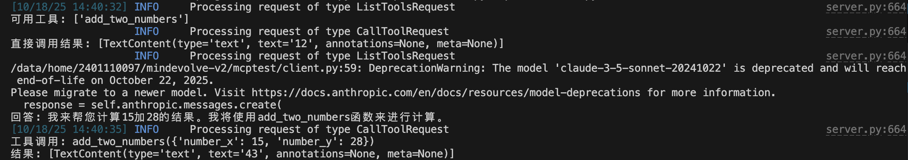

# MCP Server

参考官方文档: [Build an MCP server](https://modelcontextprotocol.io/docs/develop/build-server) 和 [Build an MCP client](https://modelcontextprotocol.io/docs/develop/build-client)。

Model-Context-Protocol (MCP) Server 是一个遵循 MCP 规范的应用程序，它向 AI 模型或 Agent 暴露一组工具。本节将指导你如何使用 `fastmcp` 库构建 MCP 服务器和客户端。

## MCP Server 构建

一个 MCP 服务器主要包含：
1.  **服务器实例**: 使用 `FastMCP` 初始化
2.  **工具 (Tools)**: 使用 `@mcp.tool()` 装饰器注册函数
3.  **传输方式 (Transport)**: `stdio` 或 `streamable-http`

### 示例：计算器服务器

```python
# calculator_server.py
from mcp.server.fastmcp import FastMCP

mcp = FastMCP("calculator")

@mcp.tool()
async def add_two_numbers(number_x: int, number_y: int) -> int:
    """Calculate the value of number_x + number_y

    Args:
        number_x: the first integer
        number_y: the second integer
    """
    return number_x + number_y

if __name__ == "__main__":
    # 使用 stdio 传输（适合本地集成）
    mcp.run(transport='stdio')
```

### Streamable HTTP 传输

对于需要通过网络访问的场景，使用 `streamable-http` 传输：

```python
# calculator_server_http.py
from mcp.server.fastmcp import FastMCP

mcp = FastMCP("calculator", host='127.0.0.1', port=8000)

@mcp.tool()
async def add_two_numbers(number_x: int, number_y: int) -> int:
    """Calculate the value of number_x + number_y

    Args:
        number_x: the first integer
        number_y: the second integer
    """
    return number_x + number_y

if __name__ == "__main__":
    # 使用 streamable-http 传输
    mcp.run(transport="streamable-http")
```

运行服务器：

```bash
python calculator_server_http.py
```

服务器将在 `http://127.0.0.1:8000` 监听请求。

## MCP Client 构建

客户端用于连接 MCP 服务器并调用工具。以下是一个简单的客户端示例。

### 安装依赖

```bash
pip install mcp anthropic python-dotenv
```

设置环境变量（`.env` 文件）：

```
ANTHROPIC_API_KEY=your_api_key_here
```

### 客户端代码

```python
# client.py
import asyncio
import sys
from contextlib import AsyncExitStack
from mcp import ClientSession, StdioServerParameters
from mcp.client.stdio import stdio_client
from anthropic import Anthropic
from dotenv import load_dotenv

load_dotenv()

class MCPClient:
    def __init__(self):
        self.session = None
        self.exit_stack = AsyncExitStack()
        self.anthropic = Anthropic()

    async def connect_to_server(self, server_script_path: str):
        """连接到 MCP 服务器"""
        server_params = StdioServerParameters(
            command="python",
            args=[server_script_path],
            env=None
        )
        
        stdio_transport = await self.exit_stack.enter_async_context(
            stdio_client(server_params)
        )
        stdio, write = stdio_transport
        self.session = await self.exit_stack.enter_async_context(
            ClientSession(stdio, write)
        )
        
        await self.session.initialize()
        
        # 列出可用工具
        response = await self.session.list_tools()
        print("可用工具:", [tool.name for tool in response.tools])

    async def call_tool(self, tool_name: str, arguments: dict):
        """调用工具"""
        result = await self.session.call_tool(tool_name, arguments)
        return result

    async def chat(self, query: str):
        """使用 Claude 处理查询"""
        # 获取可用工具
        response = await self.session.list_tools()
        tools = [{
            "name": tool.name,
            "description": tool.description,
            "input_schema": tool.inputSchema
        } for tool in response.tools]
        
        messages = [{"role": "user", "content": query}]
        
        # 调用 Claude
        response = self.anthropic.messages.create(
            model="claude-3-5-sonnet-20241022",
            max_tokens=1000,
            messages=messages,
            tools=tools
        )
        
        # 处理工具调用
        for content in response.content:
            if content.type == 'tool_use':
                result = await self.session.call_tool(
                    content.name, 
                    content.input
                )
                print(f"工具调用: {content.name}({content.input})")
                print(f"结果: {result.content}")
            elif content.type == 'text':
                print(f"回答: {content.text}")

    async def cleanup(self):
        await self.exit_stack.aclose()

async def main():
    if len(sys.argv) < 2:
        print("用法: python client.py <server_script_path>")
        sys.exit(1)
    
    client = MCPClient()
    try:
        await client.connect_to_server(sys.argv[1])
        
        # 示例 1: 直接调用工具
        result = await client.call_tool("add_two_numbers", {
            "number_x": 5,
            "number_y": 7
        })
        print(f"直接调用结果: {result.content}")
        
        # 示例 2: 通过 Claude 调用
        await client.chat("请计算 15 加 28 等于多少？")
        
    finally:
        await client.cleanup()

if __name__ == "__main__":
    asyncio.run(main())
```

### 运行客户端

```bash
# 连接到 stdio 服务器
python client.py calculator_server.py
```

输出示例：



## 关键概念

### 传输方式选择

- **stdio**: 适合本地工具集成，通过标准输入/输出通信
- **streamable-http**: 适合网络服务，支持远程访问

### 工具定义

函数的类型提示和文档字符串会自动转换为工具元数据：

```python
@mcp.tool()
async def function_name(param1: type1, param2: type2) -> return_type:
    """工具描述
    
    Args:
        param1: 参数1描述
        param2: 参数2描述
    """
    return result
```

### 安全注意事项

使用 HTTP 传输时：
- 仅绑定到 `127.0.0.1`（开发环境）
- 实施身份验证机制（生产环境）
- 验证请求来源

## 更多示例

完整的示例代码和更多高级用法请参考：
- [MCP 官方文档](https://modelcontextprotocol.io/docs)
- [FastMCP GitHub](https://github.com/jlowin/fastmcp)
