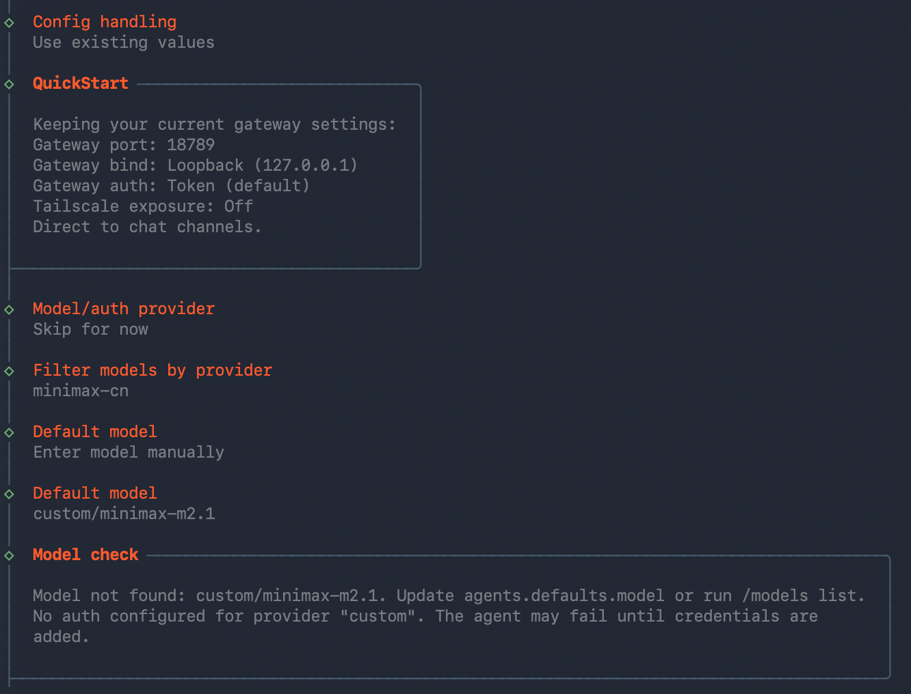
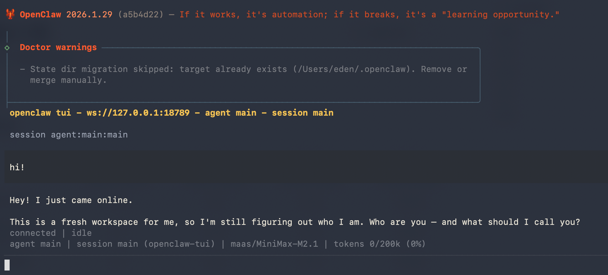

# OpenClaw（原 Clawdbot/Moltbot）

<!-- 参考来源 https://docs.openclaw.ai/start/getting-started -->

OpenClaw（原 Clawdbot/Moltbot）是一个开源的消息网关，能将 WhatsApp、Telegram、Discord、iMessage 等主流聊天平台与 AI 代理连接起来，让你直接通过手机聊天就能获得 AI 助手的响应。

## 安装

参考 [官方文档](https://docs.openclaw.ai/start/getting-started) 里面的方式进行安装，推荐使用 CLI 方式。

## 配置

在 onboard 阶段，按照提示进行配置：

- `Model/auth provider` 选择：`Skip for Now`
- Default model：选择 `manually` 手动输入模型名称 `custom/minimax-m2.1` （本网关支持 anthropic 格式的 minimax-m2.1 模型调用）。



完成初始化后，编辑配置文件 `~/.openclaw/openclaw.json`，确保 `models` 和 `agents` 字段的 `baseUrl`、`apiKey` 填写正确：

```
{
  "models": {
    "mode": "merge",
    "providers": {
      "custom": {
        "baseUrl": "<baseUrl>",
        "apiKey": "<YOUR_API_KEY>",
        "auth": "api-key",
        "api": "anthropic-messages",
        "models": [
          {
            "id": "minimax-m2.1",
            "name": "minimax-m2.1",
            "reasoning": false,
            "input": ["text"],
            "cost": {
              "input": 15,
              "output": 60,
              "cacheRead": 2,
              "cacheWrite": 10
            },
            "contextWindow": 200000,
            "maxTokens": 8192
          }
        ]
      }
    }
  },
  "agents": {
    "defaults": {
      "model": {
        "primary": "custom/minimax-m2.1"
      },
      "models": {
        "custom/minimax-m2.1": {}
      },
      "workspace": "~/.openclaw/workspace",
      "maxConcurrent": 4,
      "subagents": {
        "maxConcurrent": 8
      }
    }
  }
}
```

配置说明：

- `baseUrl`：API 地址，填写 `http://llmapi.aiphys.cn`，
- `id`：模型名称（如上面配置文件就是用的 minimax-m2.1 作为例子）。
- `workspace`：工作取区路径，对 macos 或 linux 系统来说，一般是 `"~/.openclaw/workspace"`

#### 启动使用

保存配置后，依次执行以下命令：

```bash
openclaw gateway restart
openclaw tui
```

即可进入 TUI 对话界面开始使用：


