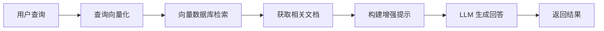

# RAG（检索增强生成）

## 📖 概述

RAG（Retrieval-Augmented Generation，检索增强生成）是一种结合了信息检索和文本生成的 AI 技术。它通过在生成回答之前先检索相关的外部知识，显著提升了大语言模型在特定领域的准确性和时效性。

本文档将基于 [Chroma](https://docs.trychroma.com/) 向量数据库，教你如何构建一个完整的本地知识库和 RAG Agent。

## 🔍 RAG 工作原理

### 传统 LLM vs RAG

**传统 LLM 的局限性**：
- 知识截止时间限制
- 无法访问私有或实时数据
- 可能产生幻觉（hallucination）
- 缺乏特定领域的深度知识

**RAG 的优势**：
- 动态获取最新信息
- 支持私有知识库
- 提供可追溯的信息来源
- 减少模型幻觉现象

### RAG 工作流程



RAG 的核心思想是将**检索**和**生成**两个步骤结合：
1. **检索阶段**：根据用户查询找到相关的知识片段
2. **生成阶段**：基于检索到的知识生成准确回答

## 🗄️ Chroma 向量数据库

Chroma 是一个专为 AI 应用设计的开源向量数据库，提供：
- **向量存储**：高效存储和检索文档嵌入
- **相似性搜索**：基于语义的快速检索
- **元数据过滤**：灵活的查询条件
- **简单易用**：Python 客户端，支持本地和云端部署

## 🚀 环境搭建

### 安装依赖

```bash
pip install chromadb openai python-dotenv
```

### 环境配置

创建 `.env` 文件：

```bash
# .env
OPENAI_API_KEY=sk-your-api-key-here
OPENAI_BASE_URL=http://your-api-endpoint/v1  # 可选，自定义 API 端点
```

## 📚 核心实现

### 1. 初始化向量数据库

```python
import chromadb
from chromadb.utils import embedding_functions
import os
from dotenv import load_dotenv

# 加载环境变量
load_dotenv()

# 创建持久化客户端
client = chromadb.PersistentClient(path="./chroma_db")

# 配置嵌入函数
openai_ef = embedding_functions.OpenAIEmbeddingFunction(
    api_key=os.getenv("OPENAI_API_KEY"),
    api_base=os.getenv("OPENAI_BASE_URL"),  # 支持自定义端点
    model_name="text-embedding-v4"
)
```

**核心概念**：Chroma 使用嵌入函数将文本转换为向量，实现语义搜索。

### 2. 创建知识库集合

```python
# 创建集合
collection = client.get_or_create_collection(
    name="knowledge_base",
    embedding_function=openai_ef,
    metadata={"description": "我的知识库"}
)

# 添加文档
documents = [
    "人工智能是计算机科学的一个分支，致力于创建能够执行通常需要人类智能的任务的系统。",
    "机器学习是人工智能的一个子集，它使计算机能够在没有明确编程的情况下学习和改进。",
    "深度学习是机器学习的一个分支，使用多层神经网络来模拟人脑的工作方式。"
]

collection.add(
    ids=[f"doc_{i}" for i in range(len(documents))],
    documents=documents,
    metadatas=[{"topic": "AI"}, {"topic": "ML"}, {"topic": "DL"}]
)
```

**核心概念**：集合（Collection）是 Chroma 中存储相关文档的容器，每个文档都会被自动向量化。

### 3. 实现检索功能

```python
def search_knowledge_base(query: str, n_results: int = 3):
    """在知识库中搜索相关文档"""
    results = collection.query(
        query_texts=[query],
        n_results=n_results,
        include=["documents", "metadatas", "distances"]
    )
    return results

# 测试检索
results = search_knowledge_base("什么是神经网络？")
```

**核心概念**：向量检索通过计算查询与文档的语义相似度，找到最相关的知识片段。

### 4. 构建 RAG Agent

```python
import openai
from typing import List, Dict, Any

class RAGAgent:
    def __init__(self, collection, api_key: str, base_url: str = None):
        self.collection = collection
        self.client = openai.OpenAI(
            api_key=api_key,
            base_url=base_url
        )
    
    def retrieve(self, query: str, n_results: int = 3) -> List[Dict]:
        """检索相关文档"""
        results = self.collection.query(
            query_texts=[query],
            n_results=n_results,
            include=["documents", "metadatas", "distances"]
        )
        
        return [{
            "content": doc,
            "metadata": meta,
            "similarity": 1 - dist
        } for doc, meta, dist in zip(
            results["documents"][0],
            results["metadatas"][0],
            results["distances"][0]
        )]
    
    def generate_response(self, query: str, retrieved_docs: List[Dict]) -> str:
        """基于检索到的文档生成回答"""
        context = "\n".join([f"文档 {i+1}: {doc['content']}" 
                           for i, doc in enumerate(retrieved_docs)])
        
        prompt = f"""基于以下文档内容回答用户问题：

相关文档:
{context}

用户问题: {query}

请基于上述文档内容提供准确回答:"""

        response = self.client.chat.completions.create(
            model="deepseek-v3",
            messages=[
                {"role": "system", "content": "你是一个基于文档内容回答问题的助手。"},
                {"role": "user", "content": prompt}
            ],
            temperature=0.7,
            max_tokens=500
        )
        
        return response.choices[0].message.content
    
    def query(self, question: str) -> Dict[str, Any]:
        """完整的 RAG 查询流程"""
        retrieved_docs = self.retrieve(question)
        answer = self.generate_response(question, retrieved_docs)
        
        return {
            "question": question,
            "answer": answer,
            "sources": retrieved_docs
        }
```

**核心概念**：RAG Agent 将检索和生成两个步骤封装成一个完整的问答系统。

### 5. 使用示例

```python
# 创建 RAG Agent
rag_agent = RAGAgent(
    collection, 
    os.getenv("OPENAI_API_KEY"),
    os.getenv("OPENAI_BASE_URL")
)

# 进行查询
result = rag_agent.query("深度学习和机器学习有什么区别？")
print("回答:", result["answer"])
```

## 🧪 实践验证

本文档的所有代码都经过了完整测试验证。你可以参考 `test_rag` 项目中的测试文件：

- `test_basic_setup.py` - 验证基础环境配置
- `test_collection.py` - 验证集合创建和文档添加
- `test_search.py` - 验证检索功能
- `test_rag_agent.py` - 验证完整 RAG Agent

运行测试：
```bash
cd test_rag
python run_all_tests.py
```

## 🔗 相关资源

- [Chroma 官方文档](https://docs.trychroma.com/)
- [OpenAI Embeddings API](https://platform.openai.com/docs/guides/embeddings)
- [完整测试项目](../../../test_rag/)

---

**下一步**：学习 [高级用法探索](./advanced-usage.md)，掌握更复杂的 Agent 设计模式。
