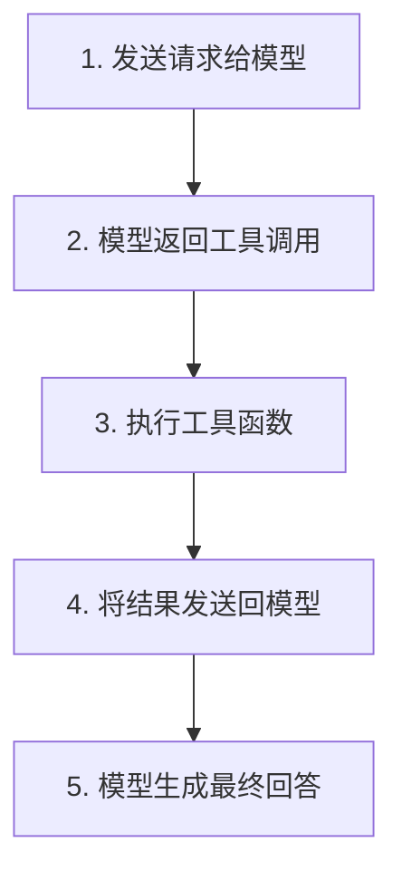

# 工具调用 (Function Calling)

## 概述

工具调用（Function Calling，也称为 Tool Calling）是 OpenAI 模型的一项强大功能，它允许模型在生成回答时调用外部函数或工具来获取额外的数据和功能。这使得 LLM 能够突破训练数据的限制，访问实时信息、执行计算、调用 API 等。

## 核心概念

### 工具 (Tools)
工具是我们提供给模型的功能接口。模型在生成回答时，可以决定是否需要使用这些工具来完成任务。

常见的工具类型：
- **获取实时数据**：天气查询、股价查询、新闻获取
- **执行计算**：数学运算、数据分析
- **访问外部服务**：数据库查询、API 调用
- **文件操作**：读取、写入、处理文件

### 工具调用 (Tool Calls)
当模型分析用户的请求后，如果判断需要使用某个工具，它会生成一个工具调用请求，包含：
- 要调用的函数名称
- 函数参数
- 调用 ID（用于追踪）

### 工具调用输出 (Tool Call Outputs)
工具执行后返回的结果，可以是：
- 结构化的 JSON 数据
- 纯文本信息
- 错误信息

## 工作流程

Function Calling 遵循以下 5 步流程：



### 详细步骤

1. **发送请求**：向模型发送用户问题和可用工具列表
2. **模型决策**：模型分析问题，决定是否需要调用工具
3. **执行工具**：应用程序执行相应的函数
4. **返回结果**：将工具执行结果发送回模型
5. **生成回答**：模型基于工具结果生成最终回答

## 函数定义

### 基本结构

```python
tools = [
    {
        "type": "function",
        "function": {
            "name": "function_name",
            "description": "函数功能描述",
            "parameters": {
                "type": "object",
                "properties": {
                    "param1": {
                        "type": "string",
                        "description": "参数描述"
                    }
                },
                "required": ["param1"]
            }
        }
    }
]
```

### 参数说明

| 字段 | 说明 |
|------|------|
| `type` | 固定为 "function" |
| `name` | 函数名称 |
| `description` | 函数功能的详细描述 |
| `parameters` | JSON Schema 格式的参数定义 |
| `required` | 必需参数列表 |

## 实践示例

### 天气查询示例

以下是一个完整的天气查询 Function Calling 示例：

```python
from openai import OpenAI
import json

# 定义工具
tools = [
    {
        "type": "function",
        "function": {
            "name": "get_weather",
            "description": "获取指定地点的天气信息",
            "parameters": {
                "type": "object",
                "properties": {
                    "location": {
                        "type": "string",
                        "description": "城市名称"
                    },
                    "unit": {
                        "type": "string",
                        "enum": ["celsius", "fahrenheit"],
                        "description": "温度单位"
                    }
                },
                "required": ["location"]
            }
        }
    }
]

# 实际的工具函数
def get_weather(location, unit="celsius"):
    # 模拟天气数据
    return {
        "location": location,
        "temperature": 22,
        "condition": "晴天",
        "unit": "°C" if unit == "celsius" else "°F"
    }

# 使用示例
client = OpenAI()

# 第一次调用
response = client.chat.completions.create(
    model="gpt-5",
    messages=[{"role": "user", "content": "北京今天天气怎么样？"}],
    tools=tools
)

# 处理工具调用
if response.choices[0].message.tool_calls:
    for tool_call in response.choices[0].message.tool_calls:
        function_name = tool_call.function.name
        function_args = json.loads(tool_call.function.arguments)
        
        # 执行函数
        result = get_weather(**function_args)
        
        # 继续对话...
```

## 高级功能

### 并行函数调用

模型可以在一次回答中调用多个函数：

```python
# 模型可能同时调用多个函数
response.choices[0].message.tool_calls  # 可能包含多个工具调用
```

### 工具选择控制

```python
# 自动选择（默认）
tool_choice="auto"

# 强制调用工具
tool_choice="required"

# 强制调用特定函数
tool_choice={"type": "function", "name": "get_weather"}

# 禁用工具调用
tool_choice="none"
```

### 流式响应

```python
stream = client.chat.completions.create(
    model="gpt-5",
    messages=messages,
    tools=tools,
    stream=True
)

for chunk in stream:
    # 处理流式响应
    pass
```

## 常见问题

### Q: 模型什么时候会调用函数？
A: 模型会根据用户的问题和函数描述自动判断。确保函数描述清晰准确，有助于模型做出正确决策。

### Q: 如何处理函数调用失败？
A: 应该在函数中添加异常处理，并返回错误信息给模型，让模型能够适当地回应用户。

### Q: 可以嵌套调用函数吗？
A: 不能直接嵌套，但可以在一轮对话中多次调用不同函数，或者在函数内部调用其他函数。

### Q: 函数调用会消耗多少 token？
A: 函数定义会计入输入 token，函数调用和结果也会消耗 token。建议优化函数描述长度。

## 扩展阅读

- [OpenAI Function Calling 官方文档](https://platform.openai.com/docs/guides/function-calling)
- [更多代码示例](./code-examples/index)
- [高级用法：MCP 服务器](./mcp-server)

## 练习建议

1. **基础练习**：修改天气查询示例，添加更多城市数据
2. **进阶练习**：创建一个计算器工具，支持基本数学运算
3. **高级练习**：集成真实的 API（如天气 API），实现实时数据查询
4. **综合练习**：创建一个多功能助手，结合多个工具（天气、计算、翻译等）

通过这些练习，你将更好地掌握 Function Calling 的使用技巧和最佳实践。
