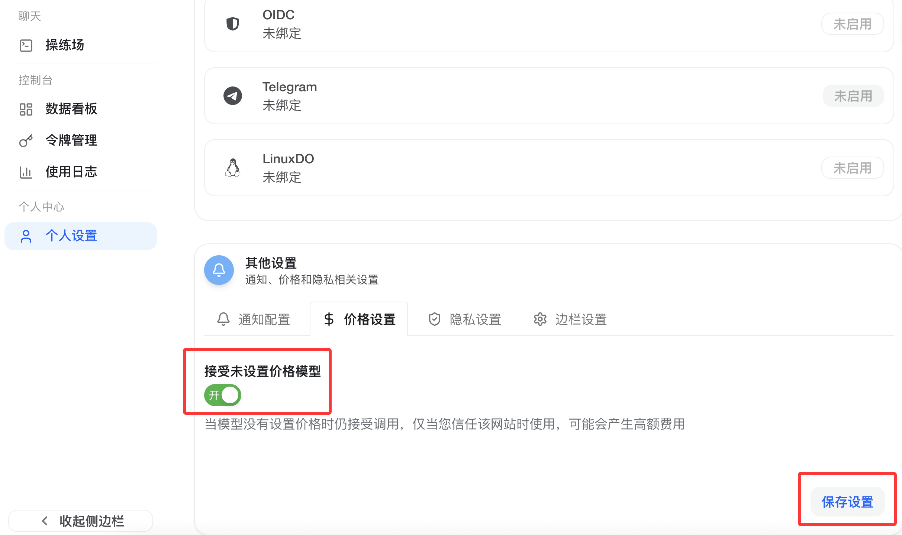
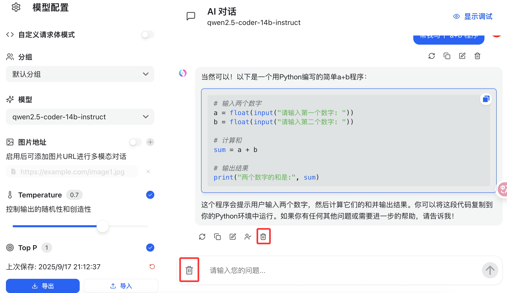
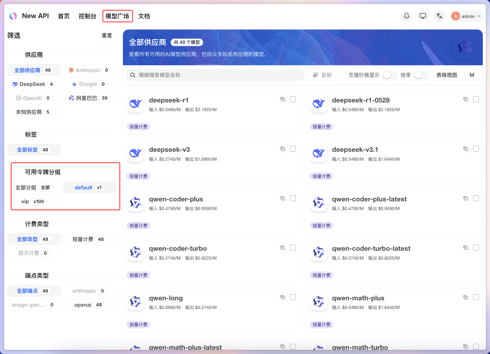
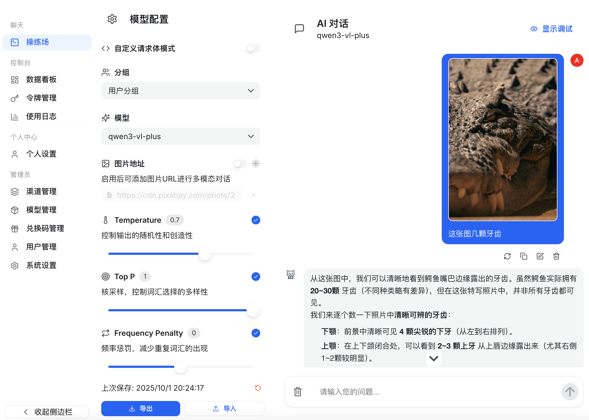
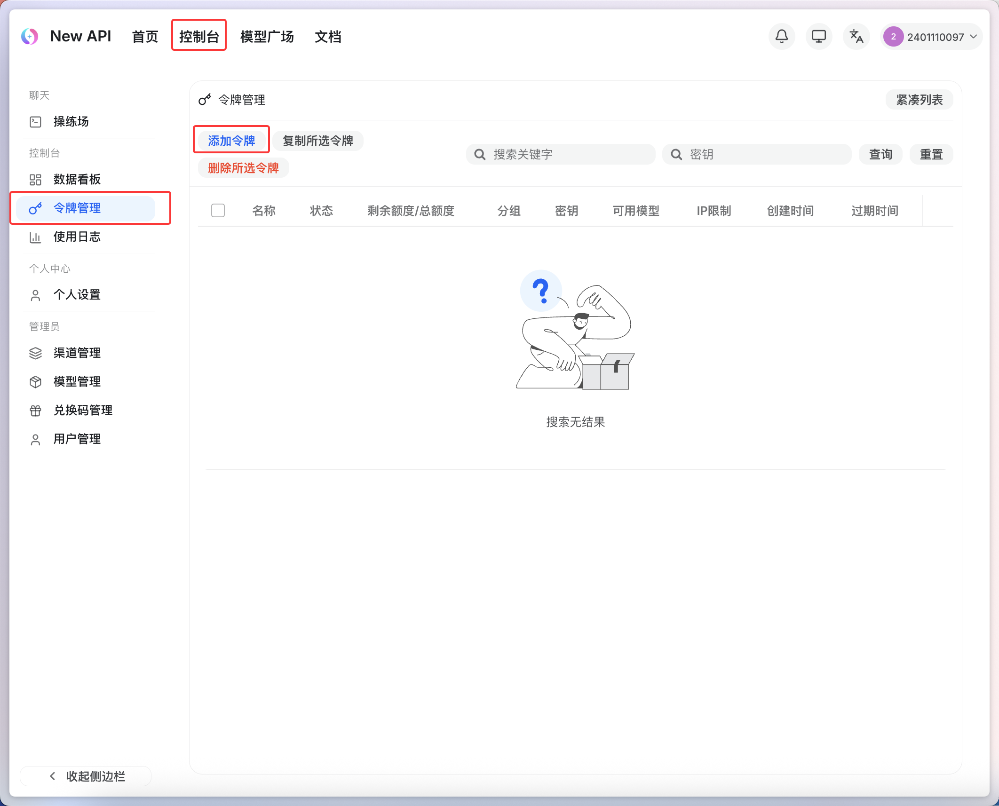

# 北大物理学院 LLM 网关

我们在服务器上部署了 LLM 网关服务：http://162.105.151.181/ 。该平台基于 New API 设计和开发。若您在使用中遇到任何问题，请扫描页面下方内测群二维码加入内测群，或联系助教。

内测时间： 平台已于 2025年9月17日 开启内测，十几位志愿者同学测试功能并进行问题反馈，于 20 日开放注册使用。  
使用目的： 本平台**仅用于学术研究和物理与人工智能课程实践，不涉及任何商业用途**。  

## 功能说明

目前公开支持的模型（截至 2025.10.01）：
- 通义千问系列
- DeepSeek 系列

**注意**：qwen "vl" 系列大模型支持多模态功能。未来计划开放 OpenAI GPT、Claude、Gemini 等国外商用大模型的使用。

## 使用方法

### 1. 账号注册
请选修"物理与人工智能"课程的同学在网关上注册账号，**用户名请设置为您的学号**。注册完成后，管理员会为每位同学的账号设置一定的余额。
<!-- 然后请根据下图做账号设置，将“接受未设置价格模型”选项从“关”切换到“开：
 -->

### 2. 模型测试
您可以在左侧菜单栏的"操练场"中进行不同 LLM 的对话和调试。
模型操练场可以切换不同的大模型进行对话，切换的时候对话历史仍然会保留，你可以点击🗑️图标来清空或删除对话历史，以防止对话历史复杂错乱导致的大模型幻觉。

普通用户可以调用 default 分组下的大模型，可以在模型广场界面查看：

部分大模型支持多模态功能（比如图片理解）：


### 3. API 调用 （OpenAI 格式）
如需通过程序调用 LLM API：

1. 在左侧"令牌管理"处点击"添加令牌"获取 API Key
   
2. 在程序中设置环境变量：
   ```bash
   OPENAI_BASE_URL=http://162.105.151.181/v1
   OPENAI_API_KEY=sk-{YOUR_API_KEY}
   ```
3. 使用 Python 的 openai 库调用大模型：
   ```python
   import openai
   
   client = openai.OpenAI(
       base_url="http://162.105.151.181/v1",
       api_key="sk-{YOUR_API_KEY}"
   )
   ```
4. 或者用 curl 发起请求（`"stream": true` 表示流式输出）：
   ```bash
   curl -X POST http://162.105.151.181/v1/chat/completions \
   -H "Content-Type: application/json" \
   -H "Authorization: Bearer sk-{YOUR_API_KEY}" \
   -d '{
      "model": "deepseek-v3-250324",
      "messages": [{"role": "user", "content": "hello"}],
      "stream": true
   }'
   ```

### 4. API 调用 （Anthropic 格式）
如需通过程序调用 LLM API：

1. 在左侧"令牌管理"处点击"添加令牌"获取 API Key，并设置 `VIP 分组`
2. 在程序中设置环境变量：
   ```bash
   ANTHROPIC_BASE_URL=http://162.105.151.181
   ANTHROPIC_API_KEY=sk-{YOUR_API_KEY}
   ```
3. 使用 Python 的 anthropic 库调用大模型：
   ```python
   import anthropic

   client = anthropic.Anthropic(
       base_url="http://162.105.151.181",
       api_key="sk-{YOUR_API_KEY}"
   )

   response = client.messages.create(
       model="claude-sonnet-4-5-20250929",
       max_tokens=1024,
       messages=[
           {"role": "user", "content": "Hello, Claude!"}
       ]
   )
   print(response.content[0].text)
   ```
4. 或者用 curl 发起请求（`"stream": true` 表示流式输出）：
   ```bash
   curl -X POST http://162.105.151.181/v1/messages \
   -H "Content-Type: application/json" \
   -H "anthropic-version: 2023-06-01" \
   -H "x-api-key: sk-{YOUR_API_KEY}" \
   -d '{
      "model": "claude-sonnet-4-5-20250929",
      "stream": true,
      "messages": [{"role": "user", "content": "Hello"}]
   }'
   ```

### 5. API 调用 （Google Gemini 格式）
1. 在左侧"令牌管理"处点击"添加令牌"获取 API Key，并设置 `VIP 分组`
2. 在程序中设置环境变量：
   ```bash
   GEMINI_BASE_URL=http://162.105.151.181
   GEMINI_API_KEY=sk-{YOUR_API_KEY}
   ```
3. 使用 Python 的 google-generativeai 库调用大模型：
   ```python
   import google.generativeai as genai

   genai.configure(
       api_key="sk-{YOUR_API_KEY}",
       transport="rest",
       client_options={"api_endpoint": "http://162.105.151.181"}
   )

   model = genai.GenerativeModel("gemini-2.5-flash")
   response = model.generate_content("Who are you?")
   print(response.text)
   ```
4. 或者用 curl 发起请求（`:streamGenerateContent` 表示流式输出）：
   ```bash
   curl -N "http://162.105.151.181/v1beta/models/gemini-2.5-pro:streamGenerateContent" \
   -H "Content-Type: application/json" \
   -H "Authorization: Bearer sk-{YOUR_API_KEY}" \
   -d '{
      "contents": [{"parts":[{"text": "Who are you?"}]}]
   }'
   ```


## 内测群与 Bug 反馈


感谢几位参与内测的志愿者同学！这里记录一下大家发现的 New API 平台的 bug。

### 1. 模型操练场代码块复制没换行

已提 issue：https://github.com/QuantumNous/new-api/issues/1828 。
bug 已修复。

### 2. 调用某些模型会出现 access denied 报错

请联系管理员，管理员会删除哪些误添加的模型；暂时在志愿者同学的帮助下，已经移除了所有不能访问的模型。

### 3. 某些模型不支持 top_p = 1.0，但是模型操练场默认的 top_p = 1.0

某些模型 top_p 要求小于 1。请手动修改 top_p 参数。
