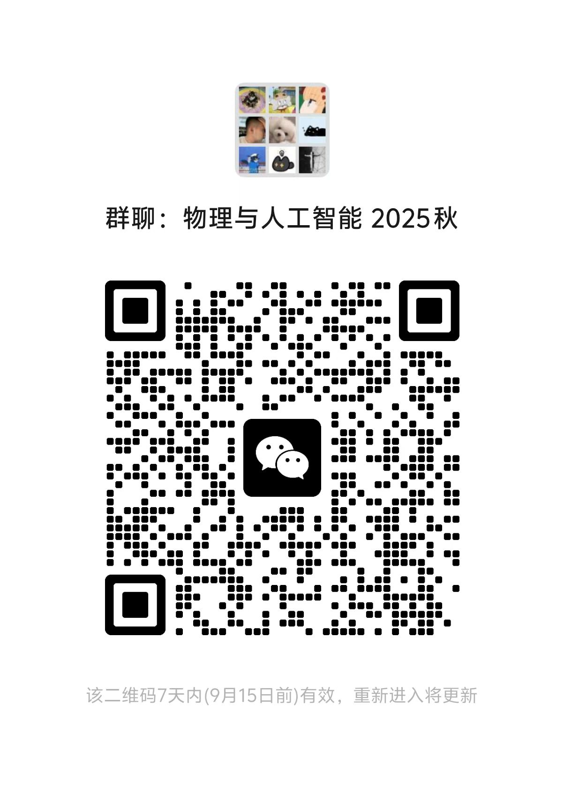

### 📱 加入课程群

### 💻 开发组招募
欢迎加入开发组，共同维护课程平台：
- LLM 网关维护
- 课程网站维护
- 物理 Agent 平台维护

**联系方式（微信）**: i-m-eden 

### 📞 联系我们
**授课教师**: 宋慧超、林晨、马滟青、冯旭、陈基、张亿、王力乐、朱华星

**助教**: 方尤乐、见东山、李想

**邮箱**: yqma@pku.edu.cn 马滟青

