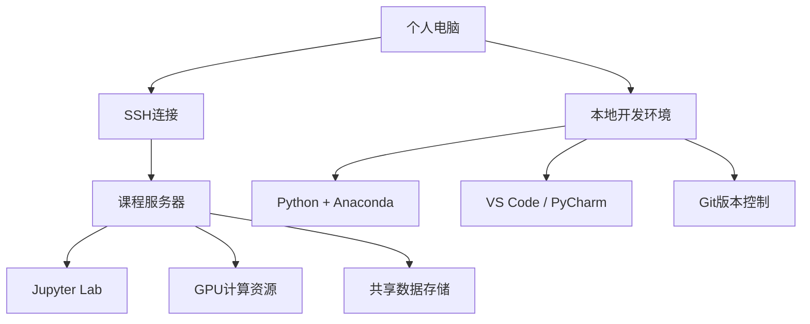

# 环境配置概述

欢迎来到AI x Physics课程的环境配置指南！为了确保所有同学都能顺利完成课程学习，我们需要配置统一的开发环境。本页面将为你提供完整的配置指导。

## 🎯 配置目标

完成环境配置后，你将能够：
- 访问课程专用服务器
- 使用Python进行科学计算
- 运行机器学习和深度学习代码
- 提交和管理作业
- 参与在线协作

## 🏗️ 整体架构



## 📋 配置清单

### ✅ 必需配置
- [ ] **服务器访问权限** - 获取VPN和SSH访问权限
- [ ] **本地Python环境** - 安装Anaconda或Miniconda
- [ ] **代码编辑器** - VS Code, PyCharm或Jupyter Lab
- [ ] **版本控制** - Git配置和GitHub账户
- [ ] **课程依赖包** - 安装必需的Python库

### 🔧 推荐配置
- [ ] **远程开发** - VS Code远程开发插件
- [ ] **终端工具** - 配置SSH客户端
- [ ] **文件同步** - 设置本地与服务器文件同步
- [ ] **浏览器书签** - 收藏课程相关链接

## 🚀 快速开始

### 第一步：获取访问权限
1. 填写[服务器申请表单](https://forms.university.edu/ai4s-server)
2. 等待管理员审批（通常1-2个工作日）
3. 收到邮件通知后下载VPN配置文件

### 第二步：连接服务器
1. 安装并配置VPN客户端
2. 使用提供的SSH密钥连接服务器
3. 验证Jupyter Lab是否可以正常访问

### 第三步：本地环境配置
1. 下载并安装Anaconda
2. 创建课程专用虚拟环境
3. 安装必需的Python包

### 第四步：代码编辑器设置
1. 安装VS Code或其他编辑器
2. 配置Python解释器
3. 安装有用的扩展插件

## 📚 详细配置指南

| 配置项目 | 详细指南 | 预计时间 |
|----------|----------|----------|
| 服务器使用 | [服务器使用指南](/setup/server) | 30分钟 |
| 计算机基础 | [计算机基础教程](/setup/computer-basics) | 1小时 |
| 开发环境 | [开发环境配置](/setup/development) | 45分钟 |
| 故障排除 | [常见问题解答](/setup/troubleshooting) | - |

## 🔍 配置验证

完成所有配置后，请运行以下验证脚本来确保环境正常：

```python
# 环境验证脚本
import sys
import numpy as np
import pandas as pd
import matplotlib.pyplot as plt
import tensorflow as tf
import torch

print("✅ Python环境验证")
print(f"Python版本: {sys.version}")
print(f"NumPy版本: {np.__version__}")
print(f"Pandas版本: {pd.__version__}")
print(f"Matplotlib版本: {plt.matplotlib.__version__}")
print(f"TensorFlow版本: {tf.__version__}")
print(f"PyTorch版本: {torch.__version__}")

# GPU可用性检查
if tf.config.list_physical_devices('GPU'):
    print("✅ TensorFlow GPU可用")
else:
    print("⚠️ TensorFlow GPU不可用")

if torch.cuda.is_available():
    print("✅ PyTorch GPU可用")
else:
    print("⚠️ PyTorch GPU不可用")

print("\n🎉 环境配置验证完成！")
```

## 💡 配置建议

::: tip 时间安排
建议在课程开始前1周完成所有配置，这样可以有充足的时间解决可能遇到的问题。
:::

::: info 协作配置
如果遇到配置问题，可以在[课程论坛](https://forum.university.edu/ai4s)寻求帮助，或者与同学组队互助。
:::

::: warning 备份重要
配置完成后，建议备份重要的配置文件和SSH密钥，以防意外丢失。
:::

## 🆘 获取帮助

如果在配置过程中遇到问题：

1. **查阅文档** - 首先查看[故障排除页面](/setup/troubleshooting)
2. **搜索论坛** - 在课程论坛搜索类似问题
3. **询问同学** - 在课程群或论坛求助
4. **联系助教** - 发邮件给助教或在答疑时间寻求帮助

### 联系方式
- **课程邮箱**: ai4s-course@university.edu
- **助教邮箱**: ai4s-ta@university.edu
- **答疑时间**: 每周三、五 15:00-17:00
- **在线论坛**: [https://forum.university.edu/ai4s](https://forum.university.edu/ai4s)

## 📅 重要时间节点

- **配置截止时间**: 第一周周末前
- **环境验证**: 第二周课程开始前
- **技术支持**: 整个学期均可获得帮助

---

*记住，好的开始是成功的一半！完善的环境配置将为你的学习之旅奠定坚实的基础。*
