# 服务器使用指南

## ssh连接服务器

每位同学都已经被分配到了一个服务器IP地址，我们可以在自己的电脑上通过ssh连接到服务器，利用服务器的GPU资源，进行程序编写、测试。不熟悉的同学请遵照以下步骤进行操作。

1. 首先确保自己连接了校园网（或者使用了学校的vpn服务（指的是接入校内的那种，不是WallessPKU那种接入境外的））。

2. 打开`命令提示符`（Windows）或`终端`（MacOS或Linux），输入以下命令：
```bash
ssh -p 2024 username@ip_address
```
其中，`username`是你的用户名（默认为`stu学号`，如`stu2000000000`），`ip_address`是你被分配到的的服务器IP地址。（`-p 2024`是指定了登陆端口 2024，必须加上这个选项。）随后，因为是首次登陆，会提示你是否确认连接，输入`yes`并按回车键确认。接下来会提示输入密码（注意密码并不会显示在窗口中），输入你的密码（默认还是`学号`）并按回车键确认。如果密码正确，你就会成功登陆到服务器上，看到类似于下面这样的界面：
```bash
Welcome to Ubuntu 20.04.6 LTS (GNU/Linux 5.15.0-67-generic x86_64)

 * Documentation:  https://help.ubuntu.com
 * Management:     https://landscape.canonical.com
 * Support:        https://ubuntu.com/advantage

 * Introducing Expanded Security Maintenance for Applications.
   Receive updates to over 25,000 software packages with your
   Ubuntu Pro subscription. Free for personal use.

     https://ubuntu.com/pro

Expanded Security Maintenance for Applications is not enabled.

0 updates can be applied immediately.

Enable ESM Apps to receive additional future security updates.
See https://ubuntu.com/esm or run: sudo pro status


The list of available updates is more than a week old.
To check for new updates run: sudo apt update
Your Hardware Enablement Stack (HWE) is supported until April 2025.
Last login: Tue Sep  3 20:17:55 2024 from 162.105.238.45
username@zkti:~$ 
```
接下来修改自己的密码，输入：
```bash
passwd
```
随后会提示输入当前密码，输入你的密码（默认还是学号）并按回车键确认。然后即可设置新密码了。
服务器上已经安装了公共的conda虚拟环境，但用户首次登录时还未激活（如果上面登陆后`username`前没有`(base)`的字样），需要依次输入以下两条命令激活：
```bash
    eval "$(/opt/miniconda/bin/conda shell.bash hook)"
    conda init
```
随后就会看到`(username)`前面多了`(base)`字样，表示已经激活成功。以后再登录就无需手动激活了。输入`conda env list`可以看到已经安装的虚拟环境，其中`pubpy`就是其中之一，里面已经安装了一些常用的python库。要进入这个虚拟环境，需输入：
```bash
conda activate pubpy
```
会看到`(base)`字样此时变成了`(pubpy)`，表示已经成功进入该虚拟环境。若要退出这个虚拟环境，需输入：
```bash
conda deactivate
```
此时可以退出服务器，只需输入`exit`并按回车键即可。

2. 设置免密登陆（强烈推荐）：如果你不想每次登陆服务器都输入密码，可以设置免密登陆。具体方法如下：
   - 在自己电脑的`C:\Users\自己电脑的用户名\.ssh`(Windows)或`~/.ssh`(MacOS或Linux)目录下检查有没有`id_rsa`和`id_rsa.pub`文件。如果没有该目录或该目录下没有这两个文件，在`命令提示符`（Windows）或`终端`（MacOS或Linux）输入：
   ```bash
   ssh-keygen
   ```
   后面的各种提示直接按回车键跳过。密钥对生成成功后，会生成上述两个文件，分别是私钥和公钥。
   - 将公钥上传到服务器上。对于MacOS或Linux用户，只需要在`终端`中输入：
   ```bash
   ssh-copy-id -p 2024 username@ip_address
   ```
   输入密码后，公钥就会被上传到服务器上，这样你就可以免密登陆了。对于Windows用户，操作稍微麻烦一些，需要先从刚才生成的`id_rsa.pub`中把公钥（也就是那一长串东西）复制出来。登录服务器，在`～`目录下，输入`ls -lah`查看有没有`.ssh`目录，若没有，先输入`mkdir .ssh`创建该目录。创建完成后，输入`vim .ssh/authorized_keys`，按`i`进入编辑状态，将刚刚复制的本地`id_rsa.pub`中的内容粘贴，然后按`esc`退出编辑模式，输入`:wq!`保存退出(注意，":"不可省略)。`exit`退出服务器；这样就完成了免密登陆的设置。

3. 配置config文件：为了后续连接服务器时不再需要输入ssh那一长串命令以及利用vscode连接服务器的方便，在自己电脑的`C:\Users\自己电脑的用户名\.ssh`(Windows)或`~/.ssh`(MacOS或Linux)目录下新建一个名为`config`的文件（如已经存在则无需新建，直接打开该文件另起一行添加即可；这个文件的名字就是config，没有扩展名，所以注意不要弄成config.txt之类的），内容如下：
   ```
   Host server1
       HostName ip_address
       User username
       Port 2024
   ```
   其中，`server1`是你给服务器起的名字，可以任取；`ip_address`是分配的服务器IP地址，`username`就是你在服务器上的用户名。这样，以后只需输入`ssh server1`就可以连接到服务器上了。

## VSCode+Remote SSH连接服务器

下面介绍如何使用VSCode及其中的Remote SSH插件连接并使用服务器。

1. 安装VSCode：首先需要在自己的电脑上安装VSCode（https://code.visualstudio.com/ ），根据自己的操作系统下载对应的版本并安装。

2. 打开vscode，点击左侧的“扩展”按钮，搜索`Remote - SSH`插件并安装（如果想要中文界面，可以先安装simplified Chinese插件）。
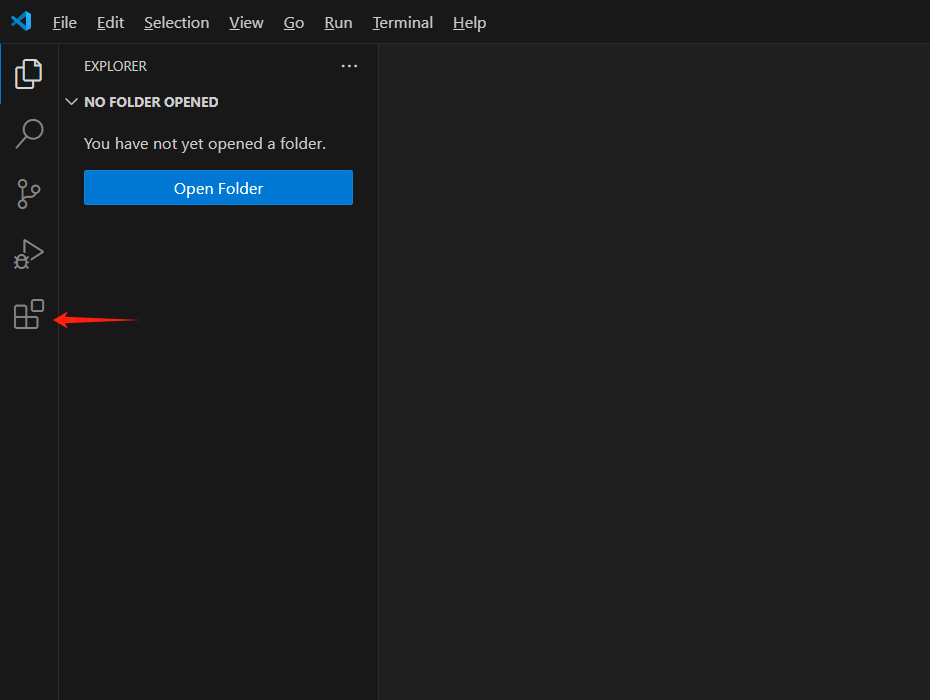 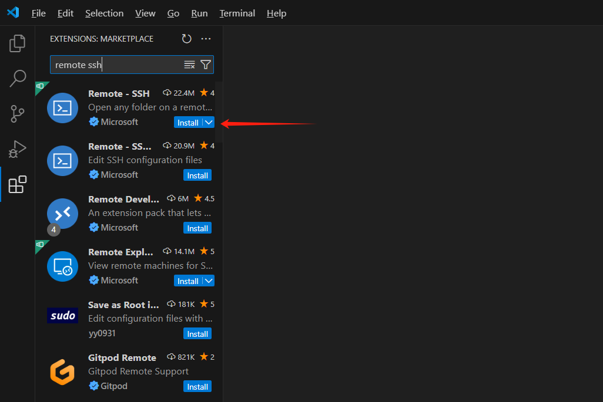 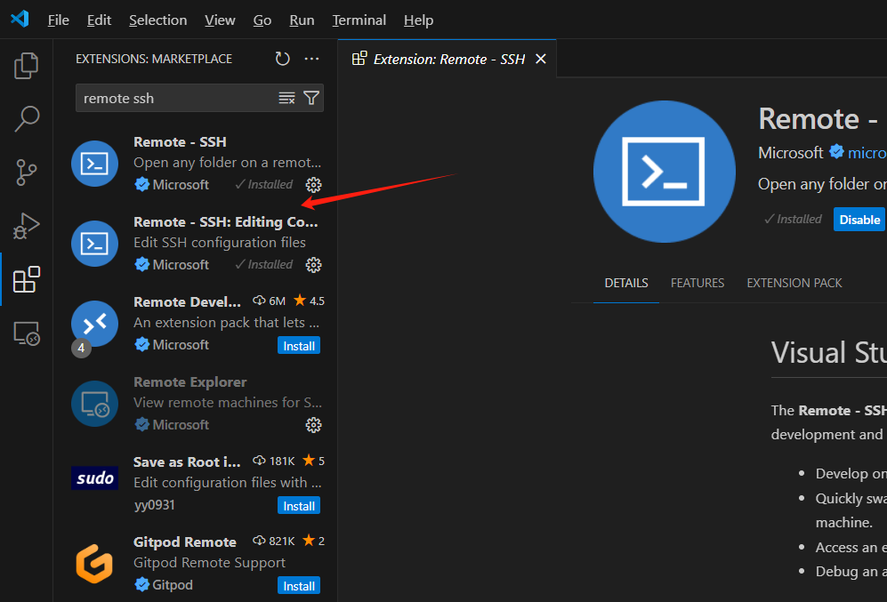 
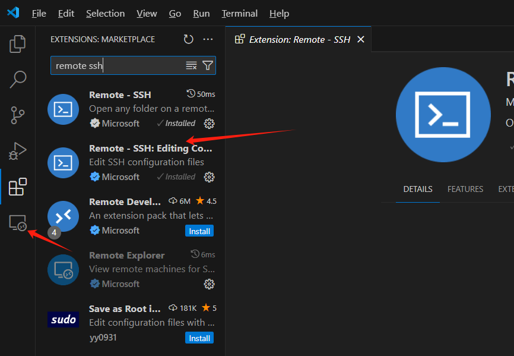

1. 安装完成后，左侧会出现该插件的图标，点击该图标，可以看到之前写入config文件的服务器名字，光标悬停在上面，点击那个向右指的箭头即可连接到服务器（会让选择操作系统，选Linux）。
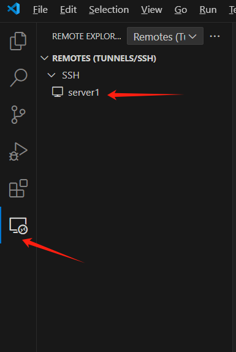 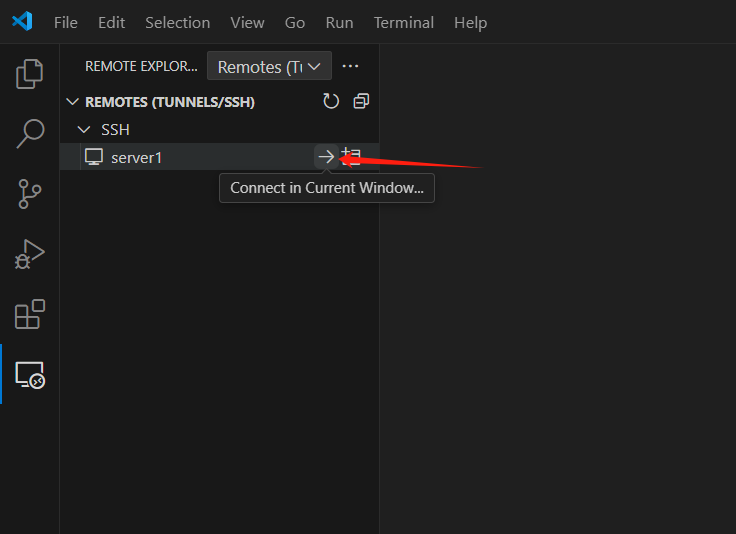 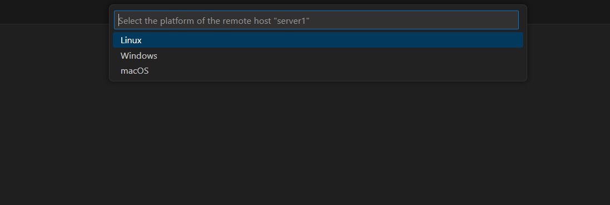
vscode随后会在服务器端安装vscode-server，可能需要一段时间。安装完成后，左下角会显示连接状态。
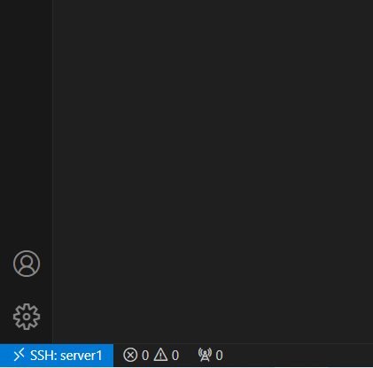

1. 如法炮制安装python、pylance、jupyter等插件。需要注意的是，如果之前在本地使用过vscode并且安装过这些插件，在连接到服务器时还需要再安装一次，因为当你用vscode远程连接到服务器时，实际上是在服务器上运行vscode-server，本地的vscode只是一个编辑器，所以还需要在服务器上安装这些插件（除了个别高亮显示之类的与程序运行本身无关的插件）。

2. vscode连接到服务器后，可以通过点击菜单栏的`‘终端’`->`‘新建终端’`打开一个终端，这与之前在命令行中连接服务器是一样的。作为测试，可以在自己的`～`目录下新建一个文件夹：
```bash
cd ~
mkdir test
```
然后在菜单栏`‘文件’`->`‘打开文件夹’`中选择刚刚新建的文件夹，就可以将vscode的工作区切换到这个文件夹中了。（可能会提示是否信任作者，选择是。）
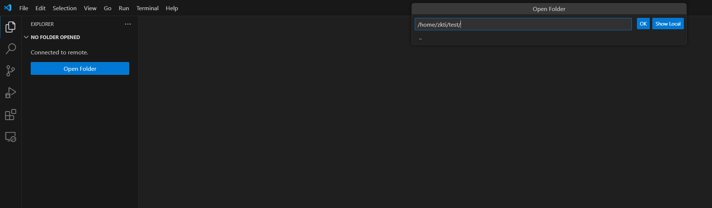

1. 在vscode中编写python程序（.py），并在虚拟环境中运行：
   - 在左侧点击如图所示位置的图标，创建一个新文件hello_world.py；
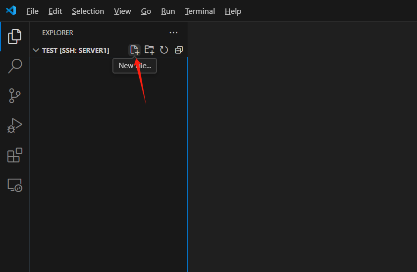 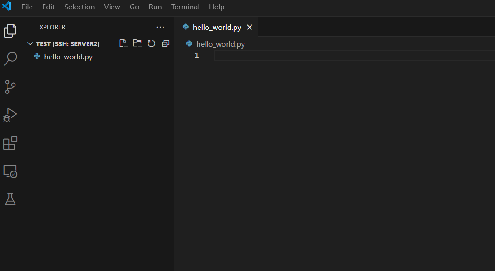
   - 在界面右下角点击选择python环境，选择pubpy。选择完成后可以看到右下角发生的变化；
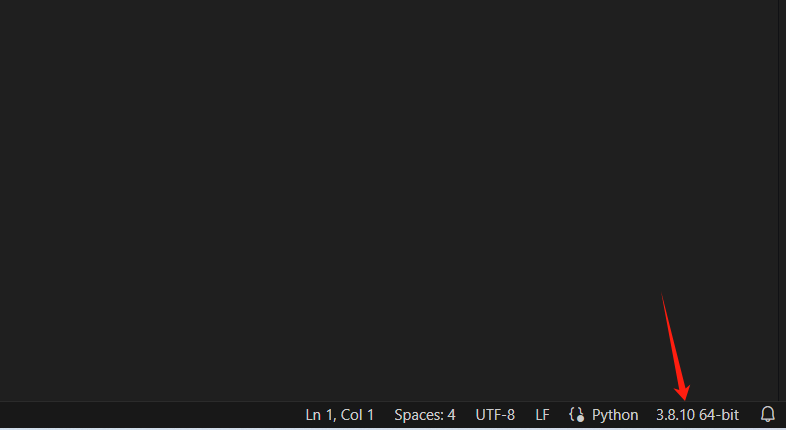 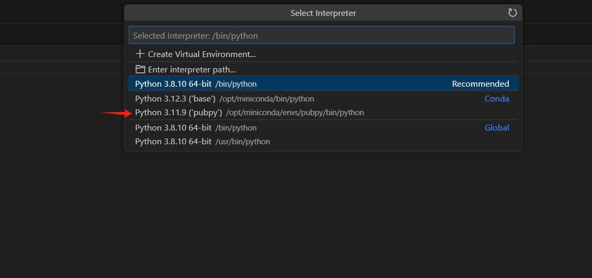 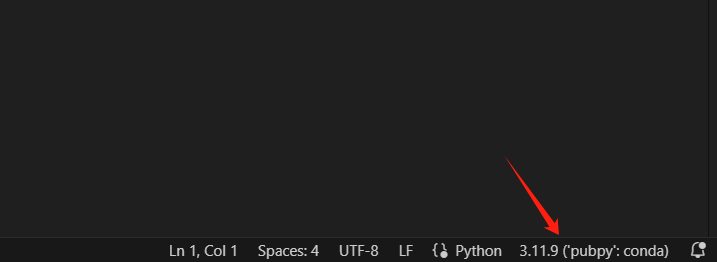
   - 在hello_world.py中输入以下代码：
```python
import torch

print(torch.cuda.is_available())
print("Hello, world!")
```
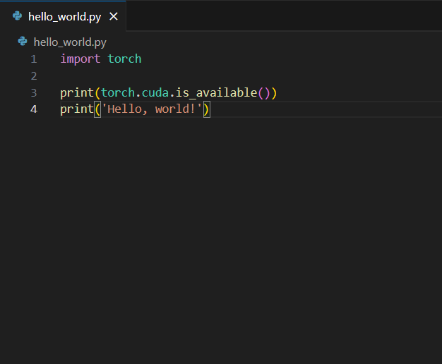
   - 点击右上角的运行按钮，在下方终端中可以看到输出结果。
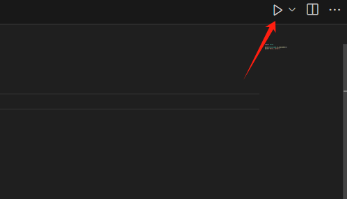 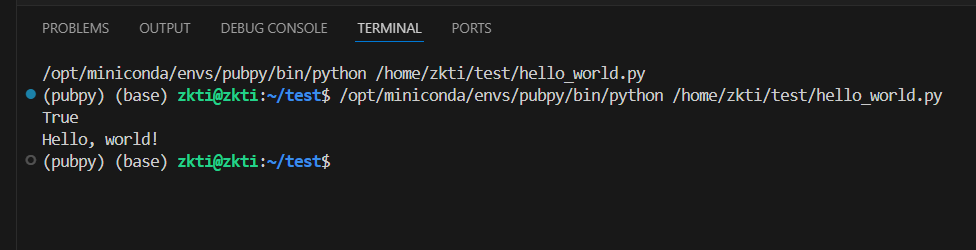

7. 在vscode中运行jupyter notebook：
   - 同上，创建一个新文件hello_world.ipynb；
   - 点击新建的jupyter notebook文件，点击如图右上角的`“选择内核”`，选择pubpy；
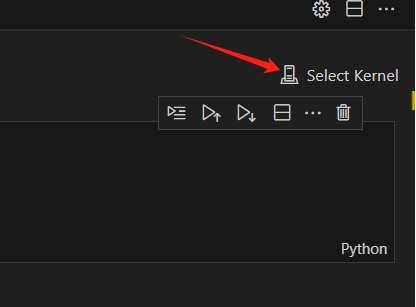 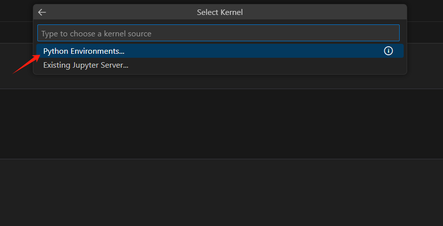 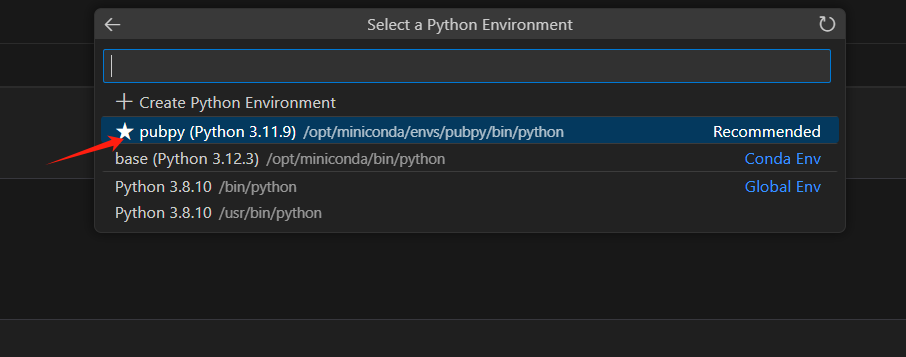
   - 在（或者新建一个）cell，输入刚才在hello_world.py中的代码，点击运行按钮，可以在cell下方看到输出结果。
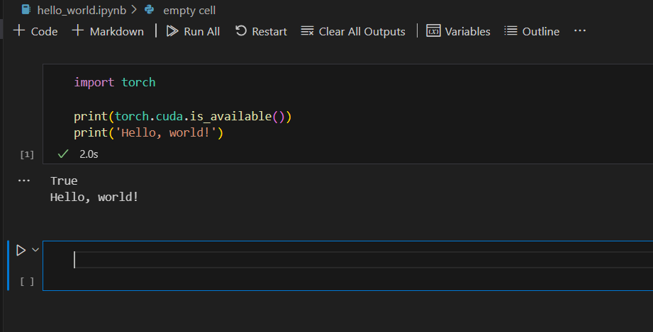

---

*记住：服务器是共享资源，请合理使用，与同学友好协作！*
